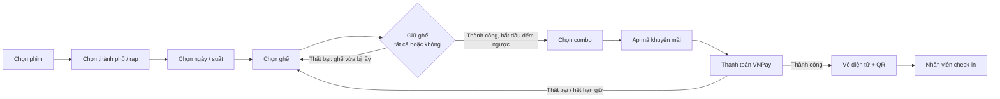

# 01 — Đặc tả yêu cầu (Requirements)

> Đề tài: **Xây dựng hệ thống đặt vé xem phim thông minh tích hợp AI Agent hỗ trợ đặt vé qua hội thoại tự nhiên**
> Giai đoạn hiện tại: hệ thống đặt vé hoàn chỉnh (chưa gồm AI Agent, nhưng thiết kế chừa sẵn điểm cắm).
> Phiên bản: 1.0 — chốt ngày 29/09/2026

## 1. Tổng quan

- Mô phỏng luồng đặt vé của một chuỗi rạp quy mô toàn quốc (tham khảo CGV), dùng **thương hiệu riêng: Cinemind**.
- Cấu trúc rạp: **Thành phố → Cụm rạp → Phòng chiếu → Ghế**. Mỗi phòng có định dạng (2D/3D/IMAX…) và sơ đồ ghế riêng.
- Nền tảng: web (responsive), chỉ tiếng Việt, thanh toán VNPay sandbox.

## 2. Tác nhân

| Tác nhân | Mô tả |
|---|---|
| Khách vãng lai (Guest) | Chưa đăng nhập; xem phim, lịch chiếu, sơ đồ ghế |
| Thành viên (USER) | Đã đăng nhập; đặt vé, thanh toán, xem "Vé của tôi" |
| Nhân viên soát vé (STAFF) | Tra cứu và check-in vé tại cửa phòng chiếu |
| Quản trị viên (ADMIN) | Quản lý phim, rạp, suất chiếu, giá, khuyến mãi, tài khoản, báo cáo |
| Hệ thống (tác vụ định kỳ) | Tự dọn lượt giữ ghế hết hạn |
| VNPay (hệ thống ngoài) | Xử lý thanh toán, gửi kết quả qua IPN |

## 3. Luồng nghiệp vụ tổng quát

**Điểm đau cần giải quyết (cốt lõi đề tài):**

1. Hai người chọn cùng một ghế cùng lúc.
2. Ghế bị "chiếm ảo" khi người dùng giữ rồi bỏ đi.
3. Lệch trạng thái thanh toán: đã trừ tiền nhưng không ra vé; đóng tab sau khi trả tiền; thanh toán xong đúng lúc hết hạn giữ ghế.
4. Một vé bị dùng nhiều lần.

## 4. Yêu cầu chức năng

Ưu tiên theo **MoSCoW**: M = Must (bắt buộc), S = Should (nên có), C = Could (có thì tốt), W = Won't (không làm lúc này). ⭐ = trọng tâm kỹ thuật của đề tài.

**Tiêu chí phân loại:** *"Bỏ tính năng này thì người dùng còn mua được vé không?"* — không → Must.

### 4.1 Khách vãng lai
| Mã | Tính năng | Ưu tiên |
|---|---|---|
| FR-01 | Danh sách phim đang chiếu / sắp chiếu | M |
| FR-02 | Chi tiết phim (mô tả, thời lượng, độ tuổi, trailer) | M |
| FR-03 | Lịch chiếu theo phim → thành phố → rạp → ngày | M |
| FR-04 | Tìm, lọc phim theo tên, thể loại | S |
| FR-05 | Lịch chiếu theo rạp | S |
| FR-06 | Banner, danh mục khuyến mãi trang chủ | C |

### 4.2 Thành viên
| Mã | Tính năng | Ưu tiên |
|---|---|---|
| FR-10 | Đăng ký, đăng nhập, đăng xuất (JWT access + refresh) | M |
| FR-11 | Xem sơ đồ ghế, chọn ghế, giữ ghế có thời hạn | M ⭐ |
| FR-12 | Chọn combo bắp nước | S |
| FR-13 | Áp mã khuyến mãi | S |
| FR-14 | Thanh toán VNPay sandbox | M ⭐ |
| FR-15 | Vé của tôi (danh sách, chi tiết, QR) | M |
| FR-16 | Hồ sơ cá nhân, đổi mật khẩu | S |
| FR-17 | Tích điểm thành viên | C |
| FR-18 | Quên mật khẩu qua email; email gửi vé | C |

### 4.3 Nhân viên soát vé
| Mã | Tính năng | Ưu tiên |
|---|---|---|
| FR-20 | Tra cứu vé bằng mã | S |
| FR-21 | Check-in vé (chặn vé đã dùng, sai suất, suất đã qua) | S |
| FR-22 | Quét QR bằng camera | C |

### 4.4 Quản trị viên
| Mã | Tính năng | Ưu tiên |
|---|---|---|
| FR-30 | Quản lý phim | M |
| FR-31 | Quản lý suất chiếu (chặn trùng phòng + giờ) | M ⭐ |
| FR-32 | Rạp, phòng, sơ đồ ghế — dữ liệu mẫu (seed) | M (màn hình CRUD: S) |
| FR-33 | Bảng giá theo loại ghế / định dạng / ngày | M |
| FR-34 | Xem danh sách đơn hàng, vé | M |
| FR-35 | Quản lý combo, mã khuyến mãi | S |
| FR-36 | Quản lý tài khoản, phân quyền (gồm nhân viên) | S |
| FR-37 | Báo cáo doanh thu theo ngày / phim / rạp | S |
| FR-38 | Quản lý banner | C |
| FR-39 | Nhật ký thao tác quản trị (audit log): ai làm gì, lúc nào; chỉ ADMIN xem | S |

### 4.5 Hệ thống
| Mã | Tính năng | Ưu tiên |
|---|---|---|
| FR-40 | Tự giải phóng ghế hết hạn giữ | M ⭐ |
| FR-41 | Nhận IPN VNPay, xác nhận đơn đúng một lần | M ⭐ |
| FR-42 | Sinh mã vé và QR | M |

## 5. Yêu cầu phi chức năng

### 5.1 Nhất quán dữ liệu (cốt lõi)
| Mã | Yêu cầu | Cách kiểm chứng |
|---|---|---|
| NFR-01 | Tại mọi thời điểm, một ghế trong một suất chỉ thuộc **tối đa 1** lượt giữ còn hạn hoặc 1 vé đã bán. Đảm bảo bằng **ràng buộc database**, không chỉ bằng kiểm tra trong code. | Bắn 50 request đồng thời giữ cùng 1 ghế → đúng 1 thành công |
| NFR-02 | Giữ nhiều ghế theo kiểu **tất cả hoặc không** trong một transaction. | Giữ 3 ghế trong đó 1 ghế đã bị lấy → không ghế nào bị giữ |
| NFR-03 | Mỗi đơn chỉ được xác nhận **đúng một lần** dù VNPay gửi IPN lặp lại (idempotent). | Gửi lại cùng IPN 3 lần → chỉ 1 bộ vé được sinh |
| NFR-04 | Server là nguồn sự thật về thời hạn giữ ghế; đồng hồ đếm ngược ở client chỉ để hiển thị. | Sửa giờ máy client không kéo dài được thời gian giữ |

### 5.2 Bảo mật
| Mã | Yêu cầu |
|---|---|
| NFR-05 | Mật khẩu được **băm (hash)** bằng bcrypt (cost ≥ 10); không lưu, không trả về mật khẩu gốc. |
| NFR-06 | Giá tiền **luôn tính lại ở server** từ database; bỏ qua mọi giá trị tiền do client gửi lên. |
| NFR-07 | Xác minh chữ ký (checksum) của mọi phản hồi VNPay và so khớp số tiền trước khi cập nhật đơn. |
| NFR-08 | Access token hết hạn sau 15 phút, refresh token 7 ngày. Phân quyền kiểm tra ở server cho từng API; người dùng chỉ xem được đơn/vé của chính mình. |
| NFR-09 | Validate dữ liệu đầu vào ở mọi API; giới hạn đăng nhập sai (5 lần / 15 phút — Should). Khóa bí mật lưu trong biến môi trường, không commit lên Git. |

### 5.3 Hiệu năng
| Mã | Yêu cầu |
|---|---|
| NFR-10 | API lịch chiếu và sơ đồ ghế: p95 < 500 ms (95% request nhanh hơn mức này) với 100 người dùng đồng thời trên môi trường demo. |
| NFR-11 | Trang chủ tải lần đầu < 3 giây trên mạng 4G. |
| NFR-12 | Sơ đồ ghế tự làm mới mỗi 10–15 giây khi người dùng đang ở màn hình chọn ghế. |

### 5.4 Độ tin cậy
| Mã | Yêu cầu |
|---|---|
| NFR-13 | Lượt giữ hết hạn không chặn người khác ngay cả khi tác vụ dọn dẹp chưa chạy; tác vụ dọn dẹp chạy ≤ 1 phút/lần. |
| NFR-14 | Đơn vẫn được xác nhận khi người dùng đóng tab sau thanh toán (dựa vào IPN, không dựa vào trang quay về). |
| NFR-15 | Ghi log mọi giao dịch thanh toán để đối soát. |

### 5.5 Khả dụng
| Mã | Yêu cầu |
|---|---|
| NFR-16 | Giao diện responsive từ 360 px (điện thoại) đến desktop. |
| NFR-17 | Thông báo lỗi bằng tiếng Việt, dễ hiểu, chỉ rõ người dùng cần làm gì tiếp. |

### 5.6 Bảo trì & mở rộng (chuẩn bị cho AI Agent)
| Mã | Yêu cầu |
|---|---|
| NFR-18 | Toàn bộ logic nghiệp vụ nằm ở lớp services; controller chỉ điều phối. Service gọi được độc lập với HTTP (để AI Agent dùng như "tool"). |
| NFR-19 | Mọi API trả response theo một format thống nhất và bộ mã lỗi chuẩn (chi tiết ở 04-api-contract.md). |
| NFR-20 | Thời gian lưu UTC, hiển thị giờ Việt Nam; tiền lưu số nguyên VND. |

## 6. Phạm vi MVP

- **MVP = toàn bộ yêu cầu mức M** (khoảng 15 tính năng) + NFR-01 → NFR-08.
- **Won't (không làm giai đoạn này):** AI Agent; hủy vé / hoàn tiền; đa ngôn ngữ; app di động; bán vé tại quầy; sơ đồ ghế realtime bằng WebSocket; trình vẽ sơ đồ ghế; gợi ý phim.
- **Thứ tự cắt giảm khi trễ tiến độ:** các mục C → FR-37 → FR-36 → FR-16. **Không cắt các mục ⭐.**

## 7. Nhật ký quyết định

| # | Quyết định | Lý do |
|---|---|---|
| D1 | Dữ liệu phim do admin nhập qua trang quản trị; dữ liệu demo nạp từ file seed | Giống cách doanh nghiệp vận hành; không phụ thuộc dịch vụ ngoài khi demo |
| D2 | Có vai trò STAFF (USER / STAFF / ADMIN) | Khép kín vòng đời vé; chi phí nhỏ |
| D3 | Đặt vé bắt buộc đăng nhập | Vé phải gắn với tài khoản để xem lại |
| D4 | Không hủy / hoàn vé | Thông lệ ngành; hoàn tiền phức tạp; đã chừa trạng thái để mở rộng |
| D5 | Giữ ghế "tất cả hoặc không", khi bấm "Tiếp tục" | Đơn giản, không để lại ghế giữ dở |
| D6 | 3 trạng thái ghế: Trống / Đang giữ / Đã bán | Minh bạch với người dùng; báo cáo chỉ tính ghế đã bán |
| D7 | Chỉ tiếng Việt; deploy là tùy chọn (tuần cuối) | Tập trung luồng cốt lõi |

## 8. Câu hỏi mở (chốt ở Giai đoạn 2)

- Thời gian giữ ghế, số ghế tối đa mỗi đơn, mốc ngừng bán trước giờ chiếu.
- Loại ghế và công thức tính giá.
- Quy tắc khuyến mãi và tích điểm.
