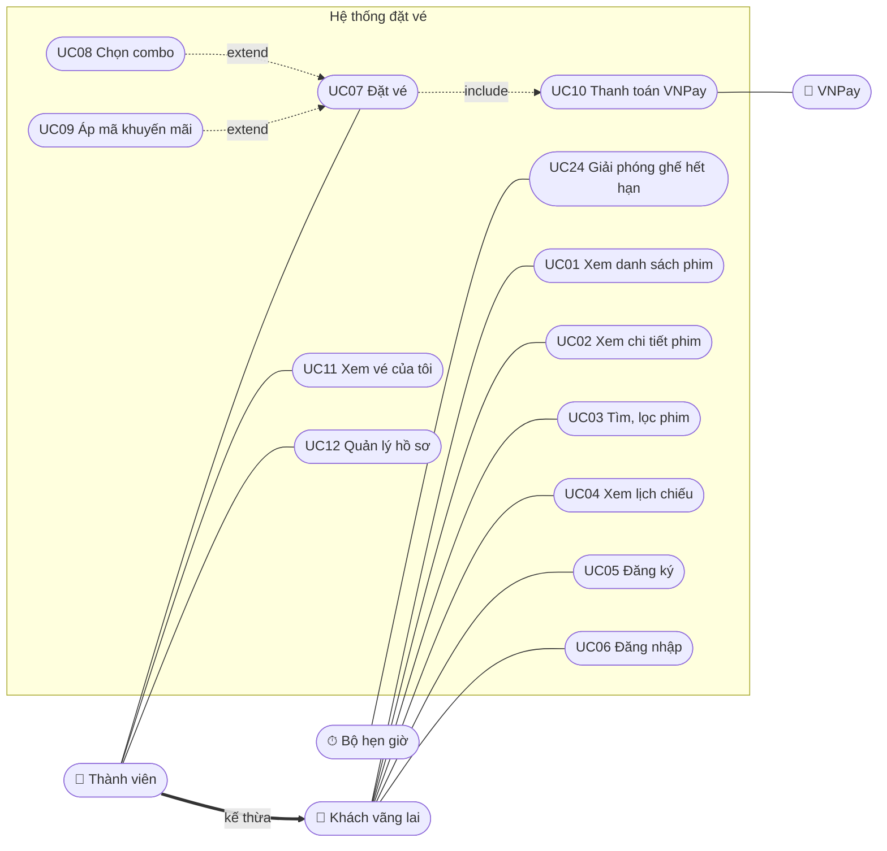
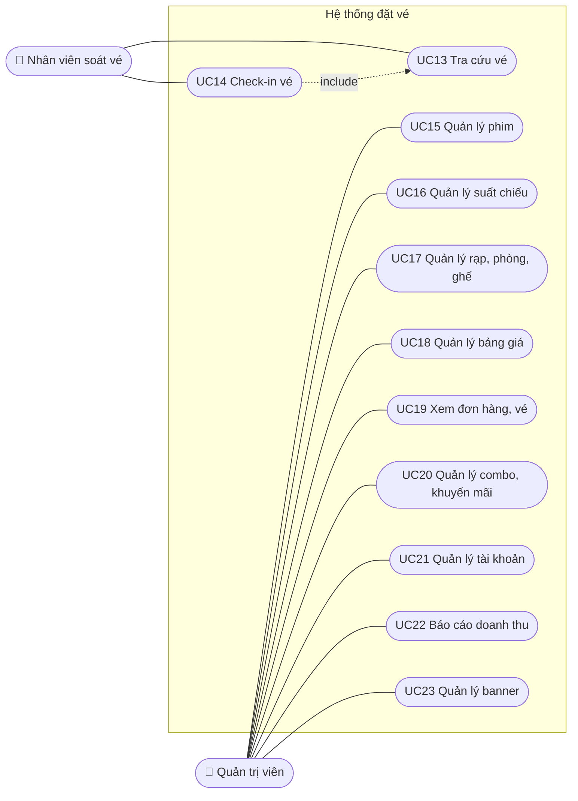

# 02 — Phân tích nghiệp vụ (Use case & luật nghiệp vụ)

> Phiên bản: 1.0 — chốt ngày 01/10/2026 (Use case, Luật nghiệp vụ, Đặc tả UC07 "Đặt vé").

## 1. Tác nhân

| Tác nhân | Loại | Ghi chú |
|---|---|---|
| Khách vãng lai | Người | Chưa đăng nhập |
| Thành viên | Người | **Kế thừa** Khách vãng lai — làm được mọi việc của khách + đặt vé |
| Nhân viên soát vé | Người | Role STAFF |
| Quản trị viên | Người | Role ADMIN |
| VNPay | Hệ thống ngoài | Chủ động gọi về server báo kết quả thanh toán (IPN) |
| Bộ hẹn giờ | Hệ thống nội bộ | Tác vụ định kỳ dọn lượt giữ ghế hết hạn |

> Tác nhân = bất kỳ ai/cái gì **ở bên ngoài** hệ thống và **tương tác** với nó — không nhất thiết là người.

## 2. Danh sách use case

| Mã | Use case | Tác nhân chính | FR liên quan | Ưu tiên |
|---|---|---|---|---|
| UC01 | Xem danh sách phim | Khách | FR-01 | M |
| UC02 | Xem chi tiết phim | Khách | FR-02 | M |
| UC03 | Tìm, lọc phim | Khách | FR-04 | S |
| UC04 | Xem lịch chiếu (theo phim / theo rạp) | Khách | FR-03, FR-05 | M |
| UC05 | Đăng ký tài khoản | Khách | FR-10 | M |
| UC06 | Đăng nhập / đăng xuất | Khách, Thành viên, NV, Admin | FR-10 | M |
| UC07 | **Đặt vé** | Thành viên | FR-11 | M ⭐ |
| UC08 | Chọn combo *(extend UC07)* | Thành viên | FR-12 | S |
| UC09 | Áp mã khuyến mãi *(extend UC07)* | Thành viên | FR-13 | S |
| UC10 | **Thanh toán VNPay** *(include trong UC07)* | Thành viên, VNPay | FR-14, FR-41 | M ⭐ |
| UC11 | Xem vé của tôi | Thành viên | FR-15 | M |
| UC12 | Quản lý hồ sơ cá nhân | Thành viên | FR-16 | S |
| UC13 | Tra cứu vé | Nhân viên | FR-20 | S |
| UC14 | Check-in vé *(include UC13)* | Nhân viên | FR-21 | S |
| UC15 | Quản lý phim | Admin | FR-30 | M |
| UC16 | **Quản lý suất chiếu** | Admin | FR-31 | M ⭐ |
| UC17 | Quản lý rạp, phòng, sơ đồ ghế | Admin | FR-32 | M (seed) / S (màn hình) |
| UC18 | Quản lý bảng giá | Admin | FR-33 | M |
| UC19 | Xem đơn hàng, vé | Admin | FR-34 | M |
| UC20 | Quản lý combo, khuyến mãi | Admin | FR-35 | S |
| UC21 | Quản lý tài khoản, phân quyền | Admin | FR-36 | S |
| UC22 | Xem báo cáo doanh thu | Admin | FR-37 | S |
| UC23 | Quản lý banner | Admin | FR-38 | C |
| UC24 | **Giải phóng ghế hết hạn** | Bộ hẹn giờ | FR-40 | M ⭐ |

**Quy ước:** "Đăng nhập" là **tiền điều kiện** (precondition) của UC07–UC23, không vẽ thành quan hệ include.

## 3. Sơ đồ use case

> Mermaid không có loại sơ đồ use case UML chuẩn, nên dùng `flowchart` mô phỏng: hình tròn dài = use case, mũi tên nét đứt = include/extend. Bản in báo cáo có thể vẽ lại bằng draw.io.

### 3.1 Phía khách hàng

### 3.2 Phía vận hành

## 4. Giải thích các quyết định mô hình hóa

| Câu hỏi | Quyết định | Lý do |
|---|---|---|
| "Đặt vé" và "Đăng nhập" | **Tiền điều kiện**, không vẽ include | Include nghĩa là A gọi B như một phần của nó. Đăng nhập xảy ra *trước*, độc lập, và áp dụng cho hầu hết use case — vẽ include sẽ rối sơ đồ. (Nhiều đồ án vẽ include; hội đồng thường chấp nhận, nhưng tiền điều kiện là cách chuẩn hơn.) |
| "Chọn combo" với "Đặt vé" | **extend** | Không bắt buộc — khách có thể bỏ qua |
| "Áp mã khuyến mãi" với "Đặt vé" | **extend** | Chỉ xảy ra khi khách có mã |
| "Thanh toán" với "Đặt vé" | **include** | Đặt vé luôn luôn phải thanh toán mới hoàn tất |
| "Chọn ghế" | **Không** là use case riêng — là **bước** trong UC07 | Không ai vào hệ thống chỉ để chọn ghế rồi đi; nó không tạo ra giá trị trọn vẹn (quy tắc ATM) |
| "Check-in" với "Tra cứu vé" | **include** | Muốn check-in luôn phải tìm ra vé trước |
| VNPay, Bộ hẹn giờ | Là **tác nhân** | Ở ngoài phạm vi logic nghiệp vụ và chủ động kích hoạt hệ thống |

> ⚠️ Chiều mũi tên: **include** trỏ từ use case gốc → use case được gọi (UC07 → UC10); **extend** trỏ từ use case mở rộng → use case gốc (UC08 → UC07).

## 5. Luật nghiệp vụ (Business Rules)

> Chốt ngày 30/09/2026. 🔴 = cốt lõi, ảnh hưởng trực tiếp thiết kế database và xử lý lỗi. Mọi luật được kiểm tra ở **server**.

### 5.1 Giữ ghế và đơn hàng
| Mã | Luật |
|---|---|
| 🔴 BR-01 | Giữ ghế **10 phút** kể từ lúc giữ thành công; không gia hạn. |
| 🔴 BR-02 | Tối đa **8 ghế** mỗi đơn (ghế đôi tính 2). |
| 🔴 BR-03 | Mỗi tài khoản chỉ có **1 đơn đang giữ ghế**; tạo đơn mới → đơn cũ tự hủy, nhả ghế. |
| BR-04 | Ngừng bán online **15 phút** trước giờ chiếu. |
| BR-05 | Ghế đôi luôn đặt **cả cặp**. |
| BR-06 | Không để trống 1 ghế lẻ kẹt giữa — **Could**, không thuộc MVP. |
| BR-07 | Người dùng được tự hủy đơn **trước** thanh toán; ghế được nhả ngay. |
| BR-08 | Không hủy / hoàn vé **sau** thanh toán. |

### 5.2 Giá vé
| Mã | Luật |
|---|---|
| BR-10 | Loại ghế: **Thường / VIP / Đôi**. |
| BR-11 | **Giá vé = Giá gốc (định dạng × loại ngày) + Phụ thu loại ghế.** |
| BR-12 | Giá gốc — 2D: 75.000 / 90.000; 3D: 100.000 / 120.000; IMAX: 140.000 / 160.000 (ngày thường / cuối tuần T6–CN & lễ). |
| BR-13 | Phụ thu — Thường: +0; VIP: +15.000; Đôi: giá gốc × 2 + 20.000 (cả cặp). |
| 🔴 BR-14 | Giá được **chốt (snapshot) vào đơn** lúc tạo đơn; đổi bảng giá sau đó không ảnh hưởng đơn cũ. |
| 🔴 BR-15 | Server tự tính mọi khoản tiền; bỏ qua giá trị tiền client gửi lên. |

### 5.3 Combo, khuyến mãi, điểm
| Mã | Luật |
|---|---|
| BR-20 | Combo cố định, giá cố định, tối đa 10 phần mỗi loại / đơn. |
| BR-21 | Mã khuyến mãi: giảm **%** (có mức giảm tối đa) hoặc giảm **số tiền cố định**. |
| BR-22 | Điều kiện: trong thời gian hiệu lực, đơn ≥ giá trị tối thiểu, còn tổng lượt, mỗi tài khoản dùng 1 lần. |
| BR-23 | Mỗi đơn **1 mã**, áp trên tổng (vé + combo); không cộng dồn. |
| 🔴 BR-24 | Lượt dùng mã chỉ bị trừ khi **thanh toán thành công**. |
| BR-25 | (Could) Tích **1 điểm / 10.000đ** thực trả, cộng khi thanh toán thành công; MVP chưa cho đổi điểm. |

### 5.4 Thanh toán và vé
| Mã | Luật |
|---|---|
| 🔴 BR-30 | Link thanh toán VNPay hết hạn **cùng lúc** với hạn giữ ghế. |
| 🔴 BR-31 | Thanh toán thành công nhưng đến **sau** khi đơn hết hạn: ghế còn trống → xác nhận bình thường; ghế đã bị lấy → đơn chuyển **"Cần hoàn tiền"**, admin xử lý thủ công. |
| BR-32 | Mã vé là chuỗi ngẫu nhiên khó đoán, không dùng số tăng dần. |
| BR-33 | **1 QR cho cả đơn**; check-in toàn bộ ghế trong đơn cùng lúc. |
| BR-34 | Check-in hợp lệ từ **30 phút trước** đến **30 phút sau** giờ bắt đầu suất chiếu. |
| BR-35 | Phân loại độ tuổi (P, K, T13, T16, T18): cảnh báo khi đặt; nhân viên kiểm tra tại cửa. |
