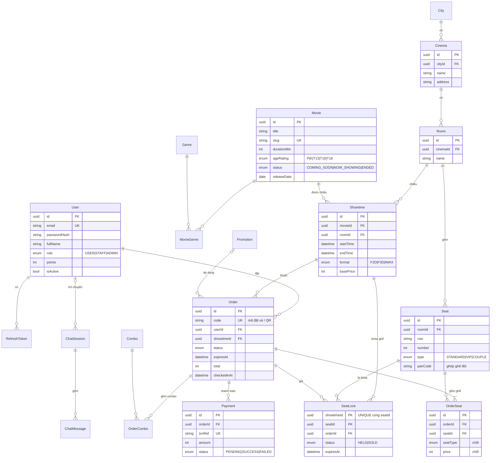

# 03 — Thiết kế cơ sở dữ liệu

> Phiên bản: 1.1 — cập nhật 02/10/2026 (thêm bảng chuẩn bị AI). Schema đầy đủ: [`schema.prisma`](./schema.prisma).
> CSDL: PostgreSQL · ORM: Prisma · Quy ước: tên bảng/cột tiếng Anh, `camelCase`; tiền là số nguyên VND; thời gian lưu UTC.

## 1. Quyết định thiết kế quan trọng

### 1.1 Ghế thuộc về đâu?

| Khái niệm | Thuộc về | Bảng |
|---|---|---|
| Ghế **vật lý** (G7, loại VIP) — tồn tại mãi | Phòng chiếu | `Seat` |
| **Trạng thái** ghế (trống / đang giữ / đã bán) — khác nhau theo từng suất | Tổ hợp (Suất chiếu, Ghế) | `SeatLock` |

- ❌ Sai phổ biến: thêm cột `status` vào `Seat` → G7 bán ở suất 18h thì bị "bán" luôn ở mọi suất.
- ✅ Chỉ lưu những ghế **đang bị chiếm** của từng suất. **Không có dòng trong `SeatLock` = ghế trống** (giống sổ đặt bàn chỉ ghi các bàn đã có người đặt).

### 1.2 Tách "khóa ghế" và "dòng hóa đơn"

| Bảng | Trả lời câu hỏi | Khi đơn hết hạn / hủy |
|---|---|---|
| `SeatLock` | *Lúc này ai đang chiếm ghế?* — chứa ràng buộc **UNIQUE (showtimeId, seatId)** chống trùng ghế | **Xóa** → ghế được nhả |
| `OrderSeat` | *Đơn này đã chọn ghế nào, giá bao nhiêu?* — lịch sử, giá đã chốt (BR-14) | **Giữ nguyên** |

Lý do phải tách: BR-31 (IPN đến muộn) cần biết đơn hết hạn từng chọn ghế nào để thử giữ lại — nếu chỉ có một bảng và đã xóa thì mất thông tin.

Suy ra trạng thái ghế của một suất:

| Dòng `SeatLock` | Trạng thái hiển thị |
|---|---|
| Không có, hoặc `HELD` nhưng `expiresAt` < bây giờ | Trống |
| `HELD` và `expiresAt` > bây giờ | Đang giữ |
| `SOLD` | Đã bán |

### 1.3 Phi chuẩn hóa có chủ đích

| Chỗ | Lý do |
|---|---|
| `OrderSeat.price`, `OrderSeat.seatType`, `OrderCombo.unitPrice` | Đóng băng giá lúc mua (BR-14) |
| `Order.total`, `Order.discount`… | Số tiền đã gửi sang VNPay phải cố định để đối soát; báo cáo nhanh |
| `Showtime.basePrice` | Giá gốc chốt khi tạo suất (tra từ `PriceRule`); admin có thể điều chỉnh riêng một suất |
| `Promotion.usedCount` | Kiểm tra "còn lượt" nhanh, cập nhật nguyên tử khi thanh toán thành công |

## 2. Danh sách bảng (22 bảng)

| Nhóm | Bảng | Mô tả | Ưu tiên |
|---|---|---|---|
| Tài khoản | `User` | Tài khoản, vai trò USER / STAFF / ADMIN, điểm | M |
| | `RefreshToken` | Refresh token (lưu dạng băm) để đăng xuất / thu hồi | M |
| Phim | `Movie` | Thông tin phim, trạng thái chiếu, phân loại độ tuổi | M |
| | `Genre` | Thể loại | M |
| | `MovieGenre` | Bảng trung gian N–N phim ↔ thể loại | M |
| Rạp | `City` | Thành phố | M |
| | `Cinema` | Cụm rạp | M |
| | `Room` | Phòng chiếu | M |
| | `Seat` | Ghế vật lý (hàng, số, loại, cặp ghế đôi) | M |
| Lịch chiếu & giá | `Showtime` | Suất chiếu: phim + phòng + giờ + định dạng + giá gốc | M |
| | `PriceRule` | Giá gốc theo (định dạng × loại ngày) — BR-12 | M |
| | `SeatTypeSurcharge` | Phụ thu theo loại ghế — BR-13 | M |
| Đặt vé | `Order` | Đơn hàng: trạng thái, hạn giữ, tổng tiền, mã đặt vé / QR, check-in | M |
| | `OrderSeat` | Ghế của đơn + giá chốt (= "vé") | M |
| | `SeatLock` | Khóa ghế theo suất — **UNIQUE chống trùng** | M ⭐ |
| | `OrderCombo` | Combo của đơn + đơn giá chốt | S |
| | `Payment` | Từng lần thanh toán VNPay của đơn (có thể thử lại nhiều lần) | M ⭐ |
| Marketing | `Combo` | Danh mục combo | S |
| | `Promotion` | Mã khuyến mãi | S |
| | `Banner` | Banner trang chủ | C |
| AI Agent | `ChatSession` | Cuộc hội thoại + bản nháp đặt vé (`state` JSON) — tạo sẵn, dùng ở giai đoạn AI | Giai đoạn AI |
| | `ChatMessage` | Từng tin nhắn / lần gọi tool trong hội thoại | Giai đoạn AI |

> Bổ sung ở Giai đoạn 5 để chuẩn bị cho AI: `Movie.searchKey` (tìm không dấu), `Order.source` (WEB / AI_CHAT), hai bảng chat. Chi tiết: `07-ai-hooks.md`.

## 3. ERD



## 4. Giải thích từng bảng

| Bảng | Cột đáng chú ý | Ràng buộc / index |
|---|---|---|
| `User` | `passwordHash` (bcrypt), `role`, `points` | UNIQUE `email` |
| `RefreshToken` | `tokenHash`, `expiresAt`, `revokedAt` | index `userId` |
| `Movie` | `slug` (dùng cho URL đẹp), `ageRating`, `status`, `posterUrl`, `trailerUrl` | UNIQUE `slug`; index `status` |
| `MovieGenre` | `movieId`, `genreId` | PK kép (movieId, genreId) |
| `Cinema` | `cityId`, `address` | index `cityId` |
| `Seat` | `row` ("G"), `number` (7), `type`, `pairCode` (2 ghế đôi cùng mã), `isActive` (ghế hỏng) | UNIQUE (roomId, row, number) |
| `Showtime` | `startTime`, `endTime` (= start + thời lượng + dọn phòng), `format`, `basePrice`, `status` | index (movieId, startTime), (roomId, startTime). Chặn trùng giờ trong cùng phòng: kiểm tra ở service |
| `PriceRule` | `format`, `dayType` (WEEKDAY / WEEKEND), `basePrice` | UNIQUE (format, dayType) |
| `SeatTypeSurcharge` | `seatType`, `surcharge` | PK `seatType` |
| `Order` | `code` (chuỗi ngẫu nhiên — BR-32), `status`, `expiresAt`, `seatTotal`, `comboTotal`, `discount`, `total`, `promotionId`, `paidAt`, `checkedInAt`, `checkedInById` | UNIQUE `code`; index (userId, createdAt), (status, expiresAt) cho tác vụ dọn dẹp |
| `OrderSeat` | `seatLabel`, `seatType`, `price` — đều là bản chốt. Ghế đôi: **mỗi ghế lưu một nửa giá cặp** để `seatTotal` = tổng `price` | UNIQUE (orderId, seatId) |
| `SeatLock` ⭐ | `orderId`, `status` (HELD / SOLD), `expiresAt` | **PK / UNIQUE (showtimeId, seatId)**; index `orderId`, `expiresAt` |
| `OrderCombo` | `quantity`, `unitPrice` (chốt) | UNIQUE (orderId, comboId) |
| `Payment` | `txnRef` (mã giao dịch gửi VNPay), `amount`, `status`, `providerTxnNo`, `rawData` (JSON để đối soát) | UNIQUE `txnRef`; index `orderId` |
| `Promotion` | `code`, `discountType` (PERCENT / FIXED), `discountValue`, `maxDiscount`, `minOrderValue`, `startAt`, `endAt`, `usageLimit`, `usedCount` | UNIQUE `code` |
| `Combo` | `name`, `price`, `imageUrl`, `isActive` | — |
| `Banner` | `imageUrl`, `linkUrl`, `sortOrder`, `startAt`, `endAt` | — |

> Quy ước "mỗi tài khoản chỉ dùng 1 mã 1 lần" (BR-22) kiểm tra bằng truy vấn `Order` có `promotionId` + `userId` + `status = PAID`; an toàn vì mỗi tài khoản chỉ có 1 đơn PENDING (BR-03).

## 5. Cơ chế giữ ghế & chống trùng ghế ⭐ (cốt lõi đề tài)

### 5.1 Nguyên lý

- **Không** "đọc xem ghế trống rồi mới ghi" (check-then-act → race condition).
- **Ghi thẳng** dòng `SeatLock`; ràng buộc **UNIQUE (showtimeId, seatId)** của PostgreSQL là **trọng tài duy nhất**: hai giao dịch cùng ghi một ghế → đúng một giao dịch thành công, giao dịch kia nhận lỗi vi phạm UNIQUE (PostgreSQL `23505`, Prisma `P2002`).
- Mọi thao tác nhiều bước nằm trong **một transaction** → hoặc tất cả thành công, hoặc không có gì thay đổi.
- Mức cô lập mặc định `READ COMMITTED` là đủ, vì sự đúng đắn dựa vào UNIQUE chứ không dựa vào việc đọc.

### 5.2 Giữ ghế — `holdSeats(userId, showtimeId, seatIds)`

**Kiểm tra trước (không cần transaction):**
1. Suất chiếu tồn tại, đang mở bán, còn > 15 phút trước giờ chiếu (BR-04).
2. 1 ≤ số ghế ≤ 8 (BR-02); ghế thuộc đúng phòng của suất; ghế `isActive`.
3. Ghế đôi đủ cặp theo `pairCode` (BR-05).
4. Tính giá từng ghế ở server: `Showtime.basePrice` + `SeatTypeSurcharge` (BR-11, BR-15).

**Trong một transaction:**

| # | Thao tác | Mục đích |
|---|---|---|
| 1 | Đơn PENDING cũ của user → `CANCELLED`; xóa `SeatLock` của đơn đó | BR-03 |
| 2 | Xóa các `SeatLock` **HELD đã quá hạn** của chính các ghế được yêu cầu trong suất này | Dọn "lười" (lazy) — không chờ tác vụ định kỳ |
| 3 | Tạo `Order` (PENDING, `expiresAt` = now + 10 phút, tổng tiền) + các `OrderSeat` (giá chốt) | BR-01, BR-14 |
| 4 | Chèn **tất cả** `SeatLock` (HELD, cùng `expiresAt`) | Trọng tài UNIQUE |
| 5 | COMMIT | |

- Bước 4 vi phạm UNIQUE → **ROLLBACK toàn bộ** (không ghế nào bị giữ, không đơn nào được tạo) → truy vấn lại các ghế đang bị chiếm → trả `409 SEAT_UNAVAILABLE` kèm danh sách ghế.
- ⚠️ **Không** dùng `createMany({ skipDuplicates: true })` cho bước 4: nó **lặng lẽ bỏ qua** ghế trùng → đơn 3 ghế mà chỉ khóa được 2 → bán trùng.

### 5.3 Hai người cùng giữ G7

```mermaid
sequenceDiagram
    participant A as Request của A
    participant DB as PostgreSQL
    participant B as Request của B
    A->>DB: BEGIN; INSERT SeatLock(suất 1, G7)
    B->>DB: BEGIN; INSERT SeatLock(suất 1, G7)
    Note over DB: B phải CHỜ vì A đang ghi cùng khóa UNIQUE
    A->>DB: COMMIT
    DB-->>A: ✅ Thành công
    DB-->>B: ❌ Vi phạm UNIQUE (23505)
    B->>DB: ROLLBACK
    Note over B: Trả 409 SEAT_UNAVAILABLE
```

Dù hai request đến cách nhau 1 mili-giây, PostgreSQL xếp chúng thành hàng; người đến sau luôn thất bại sạch sẽ.

### 5.4 Đọc sơ đồ ghế

`Seat` của phòng **LEFT JOIN** `SeatLock` của suất, rồi suy trạng thái theo bảng ở mục 1.2 (lượt giữ đã quá hạn được coi là **trống** ngay cả khi chưa bị xóa).

### 5.5 Các thao tác khác trên đơn PENDING

Chọn combo, áp mã, tạo thanh toán, hủy đơn: luôn kiểm tra `status = PENDING` **và** `expiresAt > now`; sai → `ORDER_EXPIRED`. Hủy đơn (BR-07): đơn → `CANCELLED` + xóa `SeatLock` của đơn, trong một transaction.

### 5.6 Tác vụ dọn dẹp định kỳ (mỗi 1 phút)

1. Tìm đơn `PENDING` có `expiresAt < now` (dùng index `(status, expiresAt)`).
2. Với mỗi đơn, trong transaction: cập nhật **có điều kiện** `status = EXPIRED WHERE status = PENDING` (an toàn nếu IPN vừa xác nhận đơn cùng lúc) → xóa `SeatLock` HELD của đơn.

> Tác vụ này chỉ để **dữ liệu sạch**. Nếu nó ngừng chạy, hệ thống vẫn **đúng** nhờ mục 5.2 bước 2 và mục 5.4. Chạy bằng `node-cron` trong tiến trình server.

### 5.7 Xác nhận thanh toán (IPN) — `confirmPayment(ipnData)`

1. Kiểm chữ ký → sai: từ chối (E6).
2. Tìm `Payment` theo `txnRef` → không có: từ chối. So khớp số tiền → lệch: từ chối.
3. `Payment` đã `SUCCESS` → trả "đã xác nhận", không làm gì (idempotent — E7).
4. VNPay báo thất bại → `Payment` = `FAILED`; đơn giữ nguyên (E5).
5. VNPay báo thành công → **Transaction xác nhận**:
   - Xóa `SeatLock` HELD quá hạn của **người khác** trên các ghế của đơn.
   - Với từng `OrderSeat`: nếu `SeatLock` của chính đơn còn → chuyển `SOLD`, `expiresAt = null`; nếu đã mất → chèn mới `SeatLock` SOLD (UNIQUE làm trọng tài).
   - `Order` → `PAID`, `paidAt`; `Payment` → `SUCCESS`; `Promotion.usedCount + 1` (BR-24); cộng điểm (BR-25).
6. Nếu bước 5 vi phạm UNIQUE (ghế đã bị người khác lấy — chỉ xảy ra khi IPN đến muộn) → ROLLBACK → transaction khác: `Payment` = `SUCCESS`, `Order` = `REFUND_PENDING` (BR-31, E8).

> Một thuật toán duy nhất xử lý được cả IPN đúng hạn lẫn đến muộn.

### 5.8 Vì sao chọn cách này? (chuẩn bị câu hỏi hội đồng)

| Phương án | Ưu | Nhược | Kết luận |
|---|---|---|---|
| **INSERT + UNIQUE** (đã chọn) | Đơn giản, DB đảm bảo tuyệt đối, không cần tạo trước dữ liệu | Phải bắt lỗi UNIQUE | ✅ |
| `SELECT … FOR UPDATE` (khóa bi quan) | Quen thuộc | Cần sẵn một dòng cho mỗi (suất, ghế) để khóa; dễ deadlock khi giữ nhiều ghế | ❌ |
| Cột `version` (khóa lạc quan) | Không chặn nhau | Vẫn cần dòng có sẵn; phải tự thử lại | ❌ |
| Redis lock | Rất nhanh, có TTL tự hết hạn | Thêm hạ tầng; hai nguồn sự thật (Redis và DB) dễ lệch | Để dành giai đoạn AI / mở rộng |

## 6. Schema Prisma

File đầy đủ: [`schema.prisma`](./schema.prisma) — 22 model, 16 enum. Khi bắt đầu code, chép vào `server/prisma/schema.prisma`.

### 6.1 Index và lý do

| Index | Phục vụ truy vấn |
|---|---|
| `Movie (status, releaseDate)` | Danh sách phim đang chiếu / sắp chiếu |
| `Showtime (movieId, startTime)` | Lịch chiếu theo phim và ngày (truy vấn nhiều nhất của khách) |
| `Showtime (roomId, startTime)` | Kiểm tra trùng giờ khi admin tạo suất; lịch chiếu theo rạp |
| `Order (userId, createdAt)` | "Vé của tôi" sắp xếp mới nhất |
| `Order (status, expiresAt)` | Tác vụ dọn đơn hết hạn mỗi phút |
| `Order (promotionId, userId)` | Kiểm tra mỗi tài khoản dùng mã 1 lần (BR-22) |
| `SeatLock` PK `(showtimeId, seatId)` | ⭐ Chống trùng ghế + đọc sơ đồ ghế của một suất |
| `SeatLock (orderId)` | Nhả / chốt toàn bộ ghế của một đơn |
| `Payment.txnRef` UNIQUE | Tìm giao dịch khi nhận IPN |

> Nguyên tắc: chỉ thêm index cho truy vấn thật sự hay dùng — mỗi index làm thao tác ghi chậm đi một chút.

### 6.2 Hành vi khi xóa (onDelete)

| Quan hệ | Hành vi | Lý do |
|---|---|---|
| `OrderSeat`, `OrderCombo`, `SeatLock` → `Order` | Cascade | Là "con" của đơn; không tồn tại độc lập |
| `RefreshToken` → `User`, `MovieGenre` → `Movie`/`Genre` | Cascade | Dữ liệu phụ trợ |
| Các quan hệ còn lại (Movie, Showtime, Seat, User → Order…) | Restrict (mặc định) | **Không cho xóa** dữ liệu đã có lịch sử giao dịch → admin dùng `isActive` / `status` để ẩn thay vì xóa |

### 6.3 Những gì Prisma không biểu diễn được (làm ở service hoặc migration SQL)

| Ràng buộc | Cách làm |
|---|---|
| Suất chiếu không trùng giờ trong cùng phòng | Kiểm tra ở service khi tạo / sửa suất (nâng cao: exclusion constraint của PostgreSQL) |
| `quantity > 0`, `total >= 0`, `discountValue` hợp lệ | Validate ở service; tùy chọn thêm `CHECK` trong file migration SQL |
| Ghế đôi đủ cặp, tối đa 8 ghế | Service `holdSeats` (BR-02, BR-05) |
| Giá gốc theo loại ngày | Service tra `PriceRule` khi tạo suất (T6–CN = WEEKEND) |

### 6.4 Dữ liệu mẫu (seed) cần có

2 thành phố · 4 cụm rạp · 3 phòng / rạp (sơ đồ 8–10 hàng × 12–14 ghế, có hàng VIP và hàng ghế đôi) · 15–20 phim · suất chiếu 7 ngày tới · bảng `PriceRule` + `SeatTypeSurcharge` theo BR-12, BR-13 · 4–5 combo · 3 mã khuyến mãi · tài khoản mẫu cho USER / STAFF / ADMIN.
