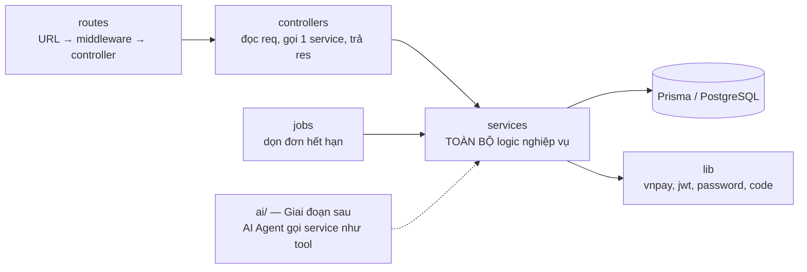

# 04 — Hợp đồng API (API Contract)

> Phiên bản: 1.1 — cập nhật 02/10/2026 · Hệ thống: **Cinemind**
> Đây là **bản cam kết** giữa Backend (Người A) và Frontend (Người B). Muốn đổi bất kỳ điều gì: thống nhất với người kia → sửa file này **trước** → rồi mới sửa code.

## 1. Quy ước chung

| Hạng mục | Quy ước |
|---|---|
| Base URL | `/api/v1` (dev: `http://localhost:4000/api/v1`) |
| Định dạng | JSON, tên trường `camelCase` |
| ID | UUID dạng chuỗi |
| Thời gian | ISO 8601 UTC, ví dụ `"2026-10-02T12:45:00.000Z"`; client tự đổi sang giờ Việt Nam. Tham số ngày dùng `YYYY-MM-DD` theo giờ Việt Nam |
| Tiền | Số nguyên VND, ví dụ `154000` |
| Phân trang | `?page=1&pageSize=20` (mặc định 1 / 20, tối đa 100) |
| Xác thực | Header `Authorization: Bearer <accessToken>` |
| Enum | Đúng tên trong `schema.prisma` (ví dụ `NOW_SHOWING`, `F2D`, `PENDING`) |

### 1.1 Định dạng response thống nhất

**Thành công**
```json
{ "success": true, "data": { } }
```

**Thành công — danh sách có phân trang**
```json
{
  "success": true,
  "data": [ ],
  "meta": { "page": 1, "pageSize": 20, "total": 57, "totalPages": 3 }
}
```

**Lỗi**
```json
{
  "success": false,
  "error": {
    "code": "SEAT_UNAVAILABLE",
    "message": "Một số ghế vừa có người chọn, vui lòng chọn ghế khác.",
    "details": { "seatIds": ["5f0c...", "9a1b..."], "seatLabels": ["G7"] }
  }
}
```
- `code`: mã máy đọc — **frontend rẽ nhánh theo `code`, không theo `message`**.
- `message`: tiếng Việt, hiển thị được cho người dùng.
- `details`: tùy chọn, thông tin thêm (lỗi validate từng trường, danh sách ghế…).
- Ngoại lệ duy nhất: endpoint IPN của VNPay trả theo định dạng VNPay yêu cầu (mục 3.6).

### 1.2 Bảng mã lỗi

| HTTP | `code` | Khi nào |
|---|---|---|
| 400 | `VALIDATION_ERROR` | Body / query sai định dạng. `details.fields = { "email": "Email không hợp lệ" }` |
| 401 | `UNAUTHORIZED` | Thiếu token hoặc token không hợp lệ |
| 401 | `TOKEN_EXPIRED` | Access token hết hạn → client gọi `/auth/refresh` rồi thử lại |
| 401 | `INVALID_CREDENTIALS` | Sai email hoặc mật khẩu |
| 403 | `FORBIDDEN` | Không đủ quyền / không phải chủ đơn |
| 403 | `ACCOUNT_DISABLED` | Tài khoản bị khóa |
| 404 | `NOT_FOUND` | Không tìm thấy tài nguyên |
| 409 | `EMAIL_EXISTS` | Đăng ký trùng email |
| 409 | `SEAT_UNAVAILABLE` ⭐ | Ghế vừa bị người khác giữ / bán. `details.seatIds`, `details.seatLabels` |
| 409 | `ORDER_NOT_PENDING` | Thao tác trên đơn không còn ở trạng thái chờ thanh toán |
| 409 | `SHOWTIME_OVERLAP` | Admin tạo suất trùng giờ trong cùng phòng. `details.conflictShowtimeId` |
| 409 | `RESOURCE_IN_USE` | Xóa dữ liệu đã có lịch sử (phim đã có suất, combo đã bán…) |
| 409 | `TICKET_ALREADY_USED` | Vé đã check-in. `details.checkedInAt` |
| 410 | `ORDER_EXPIRED` ⭐ | Đơn đã quá hạn giữ ghế |
| 422 | `SHOWTIME_CLOSED` | Suất đã hủy hoặc còn < 15 phút trước giờ chiếu (BR-04) |
| 422 | `SEAT_LIMIT_EXCEEDED` | Quá 8 ghế (BR-02) |
| 422 | `COUPLE_SEAT_INCOMPLETE` | Chọn lẻ ghế đôi (BR-05) |
| 422 | `PROMO_INVALID` | Mã không dùng được. `details.reason`: `NOT_FOUND` \| `NOT_STARTED` \| `EXPIRED` \| `USAGE_LIMIT_REACHED` \| `MIN_ORDER_NOT_MET` \| `ALREADY_USED` |
| 422 | `TICKET_NOT_PAID` | Tra cứu vé của đơn chưa thanh toán |
| 422 | `CHECKIN_NOT_ALLOWED` | Ngoài khung giờ check-in (BR-34). `details.reason`: `TOO_EARLY` \| `TOO_LATE` |
| 429 | `RATE_LIMITED` | Gọi quá nhiều lần theo IP: đăng nhập 20 lần / 15 phút, đăng ký 20 lần / giờ, `/auth/refresh` 60 lần / 15 phút, đổi mật khẩu 10 lần / 15 phút |
| 500 | `INTERNAL_ERROR` | Lỗi không mong đợi (không lộ chi tiết kỹ thuật ra ngoài) |

**Quy tắc chung về an toàn (v1.18):** body JSON tối đa 100 KB (lớn hơn → `413` với `code = VALIDATION_ERROR`); chuỗi chứa ký tự NUL (`\u0000`, `%00`) hoặc `%xx` hỏng trong URL → `400 VALIDATION_ERROR`. Mọi phản hồi có `X-Content-Type-Options: nosniff`, `X-Frame-Options: DENY`, `Referrer-Policy: no-referrer` và CSP chặn nhúng; các route `/auth`, `/me`, `/orders`, `/payments`, `/staff`, `/admin` trả `Cache-Control: no-store` (production thêm HSTS). Access token chỉ nhận thuật toán HS256.

### 1.3 Xác thực (JWT)

- **Access token**: sống 15 phút, trả trong body, client giữ trong bộ nhớ (biến/state), gửi qua header.
- **Refresh token**: sống 7 ngày, server đặt trong **cookie `httpOnly`** (JavaScript không đọc được → khó bị đánh cắp), `path=/api/v1/auth`.
- Client (Axios interceptor): nhận `401 TOKEN_EXPIRED` → gọi `POST /auth/refresh` → lưu access token mới → gửi lại request cũ. Refresh thất bại → chuyển về `/login`.
- Axios cần `withCredentials: true` để gửi cookie.
- **Rotation (v1.3):** mỗi lần `POST /auth/refresh` thành công, server thu hồi refresh token cũ và đặt cookie mới (token chỉ dùng được một lần). Response vẫn chỉ có `{ accessToken }`; client không cần xử lý thêm vì cookie do trình duyệt tự cập nhật.

### 1.4 Ký hiệu quyền

`Public` = ai cũng gọi được · `USER` = đã đăng nhập (mọi vai trò) · `Owner` = chủ đơn hàng · `STAFF` = STAFF hoặc ADMIN · `ADMIN` = chỉ ADMIN.

---

## 2. Danh sách endpoint

### 2.1 Xác thực

| Method | Path | Quyền | Body / Query | Response `data` | Lỗi chính |
|---|---|---|---|---|---|
| POST | `/auth/register` | Public | `{ email, password (≥ 8), fullName, phone? }` | `201 { user, accessToken }` + cookie | `VALIDATION_ERROR`, `EMAIL_EXISTS` |
| POST | `/auth/login` | Public | `{ email, password }` | `{ user, accessToken }` + cookie | `INVALID_CREDENTIALS`, `ACCOUNT_DISABLED`, `RATE_LIMITED` |
| POST | `/auth/refresh` | Cookie | — | `{ accessToken }` | `UNAUTHORIZED` |
| POST | `/auth/logout` | USER | — | `204` (thu hồi refresh token, xóa cookie) | — |
| GET | `/auth/me` | USER | — | `user` | `UNAUTHORIZED` |

### 2.2 Danh mục (công khai)

| Method | Path | Quyền | Query | Response `data` |
|---|---|---|---|---|
| GET | `/movies` | Public | `status`, `q`, `genreId`, `page`, `pageSize` | `MovieSummary[]` + `meta` |
| GET | `/movies/:slug` | Public | — | `MovieDetail` |
| GET | `/genres` | Public | — | `[{ id, name }]` |
| GET | `/cities` | Public | — | `[{ id, name }]` |
| GET | `/cinemas` | Public | `cityId` | `[{ id, name, address, cityId }]` |
| GET | `/movies/:movieId/showtimes` | Public | `date` (bắt buộc), `cityId` (bắt buộc) | Suất chiếu **nhóm theo rạp → định dạng** (mẫu 3.2) |
| GET | `/cinemas/:cinemaId/showtimes` | Public | `date` | Suất chiếu nhóm theo phim (S) |
| GET | `/showtimes/:id` | Public | — | `ShowtimeDetail` (phim, rạp, phòng, giờ, định dạng, `isOpenForSale`) |
| GET | `/showtimes/:id/seats` | Public | — | **Sơ đồ ghế** (mẫu 3.3) |
| GET | `/combos` | Public | — | `[{ id, name, description, price, imageUrl }]` |
| GET | `/banners` | Public | — | `[{ id, title, imageUrl, linkUrl }]` (C) |

### 2.3 Đặt vé ⭐

| Method | Path | Quyền | Body | Response `data` | Lỗi chính |
|---|---|---|---|---|---|
| POST | `/orders` | USER | `{ showtimeId, seatIds: [] }` | `201 Order` (PENDING) — mẫu 3.4 | `SEAT_UNAVAILABLE`, `SEAT_LIMIT_EXCEEDED`, `COUPLE_SEAT_INCOMPLETE`, `SHOWTIME_CLOSED`, `VALIDATION_ERROR` |
| GET | `/orders/:id` | Owner | — | `Order` | `NOT_FOUND`, `FORBIDDEN` |
| PUT | `/orders/:id/combos` | Owner | `{ items: [{ comboId, quantity }] }` — **thay cả danh sách**; `[]` = bỏ hết | `Order` (tổng tiền mới) | `ORDER_EXPIRED`, `ORDER_NOT_PENDING`, `VALIDATION_ERROR` |
| POST | `/orders/:id/promotion` | Owner | `{ code }` | `Order` | `PROMO_INVALID`, `ORDER_EXPIRED` |
| DELETE | `/orders/:id/promotion` | Owner | — | `Order` | `ORDER_EXPIRED` |
| POST | `/orders/:id/cancel` | Owner | — | `Order` (CANCELLED) | `ORDER_NOT_PENDING` |
| POST | `/orders/:id/payments` | Owner | `{ bankCode? }` | `201 { paymentId, txnRef, paymentUrl, expiresAt }` — mẫu 3.5 | `ORDER_EXPIRED`, `ORDER_NOT_PENDING` |
| GET | `/payments/:txnRef/status` | Owner | — | `{ orderId, orderStatus, paymentStatus }` — trang P07 hỏi định kỳ | `NOT_FOUND` |

### 2.4 Tài khoản của tôi

| Method | Path | Quyền | Body / Query | Response `data` |
|---|---|---|---|---|
| GET | `/me/orders` | USER | `status` (mặc định `PAID`), `page` | `OrderSummary[]` + `meta` ("Vé của tôi") |
| GET | `/me/orders/:code` | Owner | — | `Order` đầy đủ + `qrContent` — mẫu 3.7 |
| PATCH | `/me/profile` | USER | `{ fullName?, phone? }` | `user` (S) |
| PUT | `/me/password` | USER | `{ currentPassword, newPassword }` | `204` (S) |

**Hồ sơ & mật khẩu (v1.13):**
- `PATCH /me/profile` chỉ nhận `fullName` và `phone` (`null` = xóa số). Trường lạ như `role`, `email`, `points` bị từ chối `400 VALIDATION_ERROR` (không bị bỏ qua lặng lẽ). Body rỗng → 400.
- `PUT /me/password`: sai `currentPassword` → **`400 VALIDATION_ERROR`** với `details.fields.currentPassword` (không phải `401`, vì client dùng `401` để hiểu là hết phiên); `newPassword` phải ≥ 8 ký tự và khác mật khẩu cũ. Thành công trả `204` và **thu hồi mọi refresh token** (đăng xuất các thiết bị khác) nhưng đặt cookie refresh mới cho thiết bị đang dùng, nên client không cần làm gì thêm. Access token cũ còn dùng được tới khi hết hạn (tối đa 15 phút). Giới hạn 10 lần / 15 phút.

### 2.5 Thanh toán VNPay (server ↔ VNPay)

| Method | Path | Gọi bởi | Ghi chú |
|---|---|---|---|
| GET | `/payments/vnpay/ipn` | **VNPay** | Query `vnp_*` có chữ ký. Response theo định dạng VNPay (mục 3.6). Chỉ endpoint này được đổi đơn sang PAID |
| — | Return URL = `<client>/payment/result` | Trình duyệt | Trang P07 của frontend; đọc `vnp_TxnRef` trên URL rồi gọi `/payments/:txnRef/status` |
| POST | `/dev/payments/:txnRef/simulate` | Dev | `{ result: "SUCCESS" \| "FAILED" }` — **chỉ bật khi `NODE_ENV=development` VÀ `ENABLE_DEV_ROUTES=true`** (mặc định tắt; production từ chối khởi động nếu bật); giả lập IPN để test/demo khi không có mạng |

### 2.6 Nhân viên soát vé

| Method | Path | Quyền | Response `data` | Lỗi chính |
|---|---|---|---|---|
| GET | `/staff/tickets/:code` | STAFF | `{ order, canCheckIn, reason? }` | `NOT_FOUND` |
| POST | `/staff/tickets/:code/check-in` | STAFF | `Order` (có `checkedInAt`) — mẫu 3.8 | `TICKET_ALREADY_USED`, `TICKET_NOT_PAID`, `CHECKIN_NOT_ALLOWED` |

### 2.7 Quản trị (tiền tố `/admin`, quyền ADMIN)

| Nhóm | Endpoint | Ghi chú |
|---|---|---|
| Phim | `GET /admin/movies?q&status&page` · `POST /admin/movies` · `PUT /admin/movies/:id` · `PATCH /admin/movies/:id/status` `{ status }` · `DELETE /admin/movies/:id` | Xóa phim đã có suất → `RESOURCE_IN_USE`; dùng "Ngừng chiếu" (`ENDED`). Ảnh nhập dạng URL (upload file: C) |
| Thể loại | `GET/POST /admin/genres` · `PUT/DELETE /admin/genres/:id` | |
| Rạp, phòng | `GET /admin/cinemas` · `POST /admin/cinemas` · `PUT /admin/cinemas/:id` · `GET /admin/rooms/:id/seats` | Tạo phòng + sơ đồ ghế bằng seed (S: màn hình) |
| Suất chiếu | `GET /admin/showtimes?cinemaId&roomId&date&page` · `POST /admin/showtimes` `{ movieId, roomId, startTime, format, audio, basePrice? }` · `PUT /admin/showtimes/:id` · `PATCH /admin/showtimes/:id/cancel` | Server tự tính `endTime` (thời lượng + 15 phút dọn phòng) và `basePrice` từ bảng giá nếu không gửi. Trùng giờ → `SHOWTIME_OVERLAP`. Sửa / hủy suất đã bán vé → `RESOURCE_IN_USE` |
| Bảng giá | `GET /admin/pricing` → `{ priceRules[], surcharges[] }` · `PUT /admin/pricing` (cùng cấu trúc) | Không ảnh hưởng đơn / suất đã tạo (BR-14) |
| Đơn hàng | `GET /admin/orders?status&from&to&q&page` · `GET /admin/orders/:id` (kèm `payments[]`) · `PATCH /admin/orders/:id/refund` | `refund`: chỉ từ `REFUND_PENDING` → `REFUNDED` (ghi nhận hoàn tiền thủ công) |
| Combo | `GET/POST /admin/combos` · `PUT/DELETE /admin/combos/:id` | |
| Khuyến mãi | `GET/POST /admin/promotions` · `PUT/DELETE /admin/promotions/:id` | `code` tự viết hoa, duy nhất |
| Tài khoản | `GET /admin/users?q&role&page` · `POST /admin/users` (tạo STAFF) · `PATCH /admin/users/:id` `{ role?, isActive? }` | Admin không tự khóa / hạ quyền chính mình |
| Báo cáo | `GET /admin/reports/revenue?from&to&groupBy=day\|movie\|cinema` | `[{ key, label, revenue, ticketCount, orderCount }]` — chỉ tính đơn PAID |
| Banner | `GET/POST /admin/banners` · `PUT/DELETE /admin/banners/:id` | C |

Mọi endpoint danh sách admin trả `meta` phân trang; tạo mới trả `201`; xóa thành công trả `204`.

**Phim (v1.14):** `POST /admin/movies` nhận `title`, `description`, `durationMin` (1–600), `ageRating`, `releaseDate` (`YYYY-MM-DD`) và tùy chọn `status` (mặc định `COMING_SOON`), `director`, `actors`, `language`, `posterUrl`, `trailerUrl`, `genreIds[]`; trả `MovieDetail` (mục 3.0). `slug` do server sinh từ tên (trùng thì thêm `-2`, `-3`...) và **không đổi** khi sửa tên; client gửi `slug` hoặc trường lạ → `400`. `posterUrl`/`trailerUrl` chỉ nhận `http(s)://` (chặn `javascript:`, `data:`). `PUT` sửa từng phần (không nhận `status`; có `genreIds` thì thay cả danh sách thể loại). `GET /admin/movies` thấy mọi trạng thái kể cả `ENDED`. Ràng buộc với lịch chiếu → `409 RESOURCE_IN_USE`: không đổi `durationMin` và không chuyển `ENDED` khi phim còn suất `OPEN` sắp tới; không xóa phim đã từng có suất (kể cả đã qua / đã hủy). `DELETE` thành công trả `204`.

**Tài khoản (v1.15):** `GET /admin/users?q&role&page` (tìm email / họ tên, không lộ mật khẩu). `POST /admin/users` **luôn tạo `STAFF`**, không nhận `role` (gửi → `400`); body `{ email, password (≥ 8), fullName, phone? }`; email trùng → `409 EMAIL_EXISTS`. `PATCH /admin/users/:id` nhận `{ role?, isActive? }` (trường lạ → `400`). Quy tắc → `403 FORBIDDEN`: admin không tự khóa hoặc tự đổi vai trò của chính mình; luôn phải còn ít nhất một admin đang hoạt động. Khóa tài khoản thu hồi mọi refresh token. **Hiệu lực:** `/admin/*` và `/staff/*` đọc lại vai trò và trạng thái từ DB ở mỗi request nên khóa / hạ quyền có hiệu lực **ngay** (token cũ nhận `403 FORBIDDEN` hoặc `403 ACCOUNT_DISABLED`); các route khách hàng thường vẫn chấp nhận access token cũ tới khi hết hạn (tối đa 15 phút).

**Thể loại, combo, khuyến mãi (v1.16):** body của mọi `POST`/`PUT` không chấp nhận trường lạ (`400`). Trùng tên thể loại / trùng mã khuyến mãi → `400 VALIDATION_ERROR` với `details.fields.name` / `details.fields.code` (để hiện ngay ở ô nhập). `DELETE` trả `204`; thể loại đang gắn phim, combo đã có trong đơn, mã khuyến mãi đã gắn vào đơn → `409 RESOURCE_IN_USE` (với combo và mã: chuyển `isActive = false` để ngừng bán / tắt mã). `GET /admin/genres` trả thêm `movieCount`; `GET /admin/combos` gồm cả combo đã ngừng bán (`GET /combos` công khai chỉ trả combo đang bán). Đổi giá combo không ảnh hưởng đơn đã tạo (BR-14). **Combo:** `{ name, price (VND, nguyên, 0–10.000.000), description?, imageUrl? (http/https), isActive? }`. **Khuyến mãi:** `{ code, name, discountType, discountValue, startAt, endAt, description?, maxDiscount?, minOrderValue?, usageLimit?, isActive? }`; `code` tự viết hoa, 3–30 ký tự `A-Z 0-9 - _`; `PERCENT` có `discountValue` 1–100, `maxDiscount` chỉ dùng với `PERCENT`, `endAt` phải sau `startAt`; `PUT` sửa từng phần, **không** đổi được `code` và `usedCount`, và các ràng buộc được kiểm tra trên dữ liệu sau khi trộn với bản cũ.

**Bảng giá và banner (v1.17):** `GET /admin/pricing` trả `{ priceRules: [{ format, dayType, basePrice }] (6 phần tử), surcharges: [{ seatType, surcharge }] (3 phần tử) }`. `PUT /admin/pricing` nhận **đúng cấu trúc đó, đủ 6 + 3 ô, mỗi ô đúng một lần** (thiếu / trùng / giá âm hoặc lẻ / trường lạ → `400`), ghi trong một transaction nên hoặc cả bảng đổi hoặc không gì đổi. Giá là số nguyên VND, 0–5.000.000. Phạm vi ảnh hưởng: suất chiếu **đã tạo** giữ nguyên `basePrice` và đơn đã tạo giữ nguyên giá (BR-14); giá gốc mới chỉ áp cho suất tạo **mới**; phụ thu loại ghế được đọc lúc giữ ghế nên áp cho đơn mới trên mọi suất. **Banner:** `{ title, imageUrl, linkUrl?, sortOrder?, isActive?, startAt?, endAt? }`; `imageUrl` / `linkUrl` chỉ nhận `http(s)://` hoặc đường dẫn nội bộ bắt đầu bằng một dấu `/` (cấm `//host`, `javascript:`, `data:`...); `endAt` phải sau `startAt` (kiểm tra sau khi trộn khi sửa từng phần); xóa → `204`. `GET /admin/banners` trả mọi banner; `GET /banners` công khai chỉ trả banner đang bật và trong khung thời gian, theo `sortOrder`.

**Suất chiếu (v1.10):** mỗi phần tử trả `{ id, startTime, endTime, format, audio, basePrice, status, movie: { id, title }, cinema: { id, name }, room: { id, name } }`. `startTime` nhận chuỗi ISO 8601 và phải ở tương lai. Trùng giờ = hai khoảng `[start, end)` chồng nhau trong cùng phòng, bỏ qua suất đã hủy; suất nối đuôi (bắt đầu đúng lúc suất trước kết thúc) **không** trùng. "Đã bán vé" (`RESOURCE_IN_USE`) = suất có đơn `PAID`, `REFUND_PENDING`, hoặc `PENDING` còn hạn giữ ghế. Hủy suất là đổi `status = CANCELLED` (không xóa); gọi lại trên suất đã hủy trả nguyên suất đó. Cả nhóm `/admin/*` chỉ ADMIN (STAFF nhận `403`).

**Đơn hàng (v1.11):** `GET /admin/orders` trả mỗi đơn `{ id, code, status, total, createdAt, paidAt, checkedInAt, user: { id, email, fullName }, seatLabels, showtime: { startTime, movieTitle, cinemaName } }`, mới nhất trước; `q` tìm theo mã đơn / email / họ tên (không phân biệt hoa-thường); `from`/`to` là `YYYY-MM-DD` giờ VN, `to` gồm cả ngày đó. `GET /admin/orders/:id` trả `Order` + `user` + `payments[]` (không có dữ liệu thô của cổng thanh toán). `PATCH /admin/orders/:id/refund` chỉ nhận đơn `REFUND_PENDING`; đơn ở trạng thái khác (kể cả đã `REFUNDED`) → `409 ORDER_NOT_PENDING`. Hệ thống **không tự chuyển tiền**: admin hoàn qua VNPay rồi bấm ghi nhận.

**Báo cáo doanh thu (v1.12):** `GET /admin/reports/revenue?from&to&groupBy` — `from`/`to` là `YYYY-MM-DD` giờ VN, gồm cả ngày `to`; mặc định là 30 ngày kết thúc hôm nay; tối đa 366 ngày (quá hoặc `from > to` → `400 VALIDATION_ERROR`); `groupBy` ∈ `day` (mặc định) | `movie` | `cinema`. Chỉ tính đơn `PAID`, ngày tính theo `paidAt` (lúc thu tiền) theo giờ VN. `revenue` = tổng tiền khách thực trả (sau giảm giá), `ticketCount` = số ghế (ghế đôi tính 2), `orderCount` = số đơn. `day` trả đủ mọi ngày trong khoảng, ngày không có doanh thu có `revenue = 0` (để vẽ biểu đồ liên tục); `movie`/`cinema` chỉ liệt kê nhóm có doanh thu, xếp theo doanh thu giảm dần. Đơn `REFUND_PENDING`, `REFUNDED` không tính.

---

## 3. Mẫu request / response

### 3.0 `MovieSummary` và `MovieDetail` (v1.4)
```json
// MovieSummary — phần tử của GET /movies
{ "id": "m1...", "title": "Nhà Bà Tư", "slug": "nha-ba-tu", "posterUrl": null, "durationMin": 102,
  "ageRating": "T13", "status": "NOW_SHOWING", "releaseDate": "2026-09-12",
  "genres": [{ "id": "g1...", "name": "Hài" }] }

// MovieDetail — GET /movies/:slug = MovieSummary + các trường sau
{ "description": "...", "director": "...", "actors": "A, B", "language": "Tiếng Việt", "trailerUrl": null }
```
- `GET /movies`: sắp xếp `releaseDate` mới → cũ; `q` tìm theo tên không phân biệt dấu/hoa thường; `status` ∈ `NOW_SHOWING | COMING_SOON | ENDED`.
- `releaseDate` dạng `YYYY-MM-DD`.

### 3.1 `POST /auth/login`
```json
// Request
{ "email": "an.nguyen@example.com", "password": "matkhau123" }

// 200
{
  "success": true,
  "data": {
    "user": { "id": "2b1e...", "email": "an.nguyen@example.com", "fullName": "Nguyễn Văn An", "phone": "0901234567", "role": "USER", "points": 120 },
    "accessToken": "eyJhbGciOi..."
  }
}
// + Set-Cookie: refreshToken=...; HttpOnly; Path=/api/v1/auth; SameSite=Lax
```

### 3.2 `GET /movies/:movieId/showtimes?date=2026-10-02&cityId=...`
```json
{
  "success": true,
  "data": {
    "date": "2026-10-02",
    "cinemas": [
      {
        "cinema": { "id": "c1...", "name": "Cinemind Cầu Giấy", "address": "..." },
        "groups": [
          {
            "format": "F2D", "audio": "SUBTITLE",
            "showtimes": [
              { "id": "s1...", "startTime": "2026-10-02T02:30:00.000Z", "isOpenForSale": true },
              { "id": "s2...", "startTime": "2026-10-02T12:45:00.000Z", "isOpenForSale": true }
            ]
          }
        ]
      }
    ]
  }
}
```

### 3.3 `GET /showtimes/:id/seats` ⭐
```json
{
  "success": true,
  "data": {
    "showtime": {
      "id": "s2...", "startTime": "2026-10-02T12:45:00.000Z", "format": "F2D", "audio": "SUBTITLE",
      "isOpenForSale": true,
      "movie": { "id": "m1...", "title": "Tên phim", "ageRating": "T16", "posterUrl": "..." },
      "cinema": { "id": "c1...", "name": "Cinemind Cầu Giấy" },
      "room": { "id": "r3...", "name": "Phòng 3" }
    },
    "rows": ["A", "B", "C", "D", "E", "F", "G", "H"],
    "seats": [
      { "id": "x1...", "row": "A", "number": 1, "label": "A1", "type": "STANDARD", "pairCode": null, "status": "AVAILABLE", "price": 90000 },
      { "id": "x7...", "row": "G", "number": 7, "label": "G7", "type": "VIP", "pairCode": null, "status": "HELD", "price": 105000 },
      { "id": "x9...", "row": "G", "number": 8, "label": "G8", "type": "VIP", "pairCode": null, "status": "SOLD", "price": 105000 },
      { "id": "h1...", "row": "H", "number": 1, "label": "H1", "type": "COUPLE", "pairCode": "H1-2", "status": "AVAILABLE", "price": 200000 },
      { "id": "h2...", "row": "H", "number": 2, "label": "H2", "type": "COUPLE", "pairCode": "H1-2", "status": "AVAILABLE", "price": 200000 }
    ]
  }
}
```
- `ShowtimeDetail` (`GET /showtimes/:id`) chính là khối `showtime` ở trên (v1.5).
- `isOpenForSale` = suất `OPEN` **và** còn > 15 phút trước giờ chiếu (BR-04).
- `status`: `AVAILABLE` | `HELD` | `SOLD` | `UNAVAILABLE` (ghế hỏng). Lượt giữ quá hạn trả về `AVAILABLE`.
- Ghế đôi: `price` trên **mỗi** ghế của cặp là giá **cả cặp** (để hiển thị); khi giữ ghế, client gửi **cả hai** `seatId`. Trong `Order.seats`, mỗi ghế đôi có `price` = **một nửa** giá cặp, nên tổng luôn đúng.

### 3.4 `POST /orders` ⭐
```json
// Request
{ "showtimeId": "s2...", "seatIds": ["x5...", "x6..."] }

// 201
{
  "success": true,
  "data": {
    "id": "o1...",
    "code": "K7Q2M9XA",
    "status": "PENDING",
    "expiresAt": "2026-10-02T09:10:00.000Z",
    "showtime": { "id": "s2...", "startTime": "2026-10-02T12:45:00.000Z", "format": "F2D", "audio": "SUBTITLE",
                  "movie": { "title": "Tên phim", "ageRating": "T16", "posterUrl": "..." },
                  "cinema": { "name": "Cinemind Cầu Giấy" }, "room": { "name": "Phòng 3" } },
    "seats": [
      { "seatId": "x5...", "label": "G5", "type": "VIP", "price": 105000 },
      { "seatId": "x6...", "label": "G6", "type": "VIP", "price": 105000 }
    ],
    "combos": [],
    "promotion": null,
    "seatTotal": 210000,
    "comboTotal": 0,
    "discount": 0,
    "total": 210000,
    "paidAt": null,
    "checkedInAt": null
  }
}

// 409 — ghế vừa bị lấy
{
  "success": false,
  "error": {
    "code": "SEAT_UNAVAILABLE",
    "message": "Ghế G6 vừa có người chọn, vui lòng chọn ghế khác.",
    "details": { "seatIds": ["x6..."], "seatLabels": ["G6"] }
  }
}
```
> **Quy tắc combo / khuyến mãi (v1.8):** server tự tính mọi khoản tiền; giá combo chốt vào đơn lúc chọn. Mã khuyến mãi không phân biệt hoa/thường, áp trên tổng vé + combo. Nếu sau khi đổi combo mà mã không còn đủ điều kiện (vd dưới mức tối thiểu) thì **mã tự bị gỡ** (response có `promotion: null`). Đổi combo/mã **sau khi đã tạo link thanh toán** làm link cũ lệch số tiền: IPN của link đó không ghi `PAID` mà chuyển đơn `REFUND_PENDING` (client nên tạo giao dịch mới).

> Cấu trúc `Order` này dùng chung cho mọi endpoint trả về đơn hàng. Sau `PUT /combos` hoặc `POST /promotion`, `combos` có dạng `[{ comboId, name, quantity, unitPrice, subtotal }]` và `promotion` có dạng `{ code, name, discount }`.

### 3.5 `POST /orders/:id/payments`
```json
// 201
{
  "success": true,
  "data": {
    "paymentId": "p1...",
    "txnRef": "K7Q2M9XA-1",
    "paymentUrl": "https://sandbox.vnpayment.vn/paymentv2/vpcpay.html?vnp_Amount=...",
    "expiresAt": "2026-10-02T09:10:00.000Z"
  }
}
```
Client chuyển hướng: `window.location.href = paymentUrl`.

### 3.6 `GET /payments/vnpay/ipn` (VNPay gọi)
Response **theo định dạng VNPay**, không theo mục 1.1:

| Tình huống | Response |
|---|---|
| Xử lý xong (thành công hoặc ghi nhận thất bại) | `{ "RspCode": "00", "Message": "Confirm Success" }` |
| Không tìm thấy giao dịch | `{ "RspCode": "01", "Message": "Order not found" }` |
| Đã xác nhận trước đó (IPN lặp) | `{ "RspCode": "02", "Message": "Order already confirmed" }` |
| Sai số tiền | `{ "RspCode": "04", "Message": "Invalid amount" }` |
| Sai chữ ký | `{ "RspCode": "97", "Message": "Invalid signature" }` |

> Đã đối chiếu tài liệu VNPay v2.1.0 (v1.6): chữ ký HMAC-SHA512 trên các tham số `vnp_*` sắp theo tên, `vnp_Amount` = VND × 100; thanh toán chỉ thành công khi **cả** `vnp_ResponseCode` và `vnp_TransactionStatus` đều là `00`. `RspCode` 00 và 02 làm VNPay ngừng gọi lại; 01/04/97/99 thì VNPay gọi lại tối đa 10 lần, cách 5 phút. `txnRef` có dạng `<mã đơn>-<lần thứ n>`.

### 3.7 `GET /me/orders/:code`
Trả `Order` (như 3.4) với `status: "PAID"`, `paidAt`, và thêm:
```json
{ "qrContent": "CINEMIND:K7Q2M9XA" }
```
- `qrContent` chỉ có khi đơn `PAID`; các trạng thái khác trả `null` (v1.7). Mã đơn không phải của mình → `404 NOT_FOUND` (không lộ sự tồn tại của mã). Mã không phân biệt hoa/thường.

**`OrderSummary`** (phần tử của `GET /me/orders`, v1.7) — gọn hơn `Order`:
```json
{ "id": "o1...", "code": "K7Q2M9XA", "status": "PAID", "total": 210000, "createdAt": "...", "paidAt": "...", "checkedInAt": null,
  "seatLabels": ["G5", "G6"],
  "showtime": { "id": "s2...", "startTime": "...", "format": "F2D", "audio": "SUBTITLE",
                "movie": { "title": "...", "ageRating": "T16", "posterUrl": null }, "cinema": { "name": "..." }, "room": { "name": "Phòng 3" } } }
```
`GET /me/orders?status=PAID&page=1&pageSize=20`: `status` ∈ các trạng thái đơn (mặc định `PAID`), sắp theo `createdAt` mới → cũ.

Frontend tự vẽ QR từ `qrContent` (thư viện QR phía client); nhân viên quét được chuỗi → lấy phần mã sau dấu `:`.

### 3.8 `POST /staff/tickets/:code/check-in`
```json
// 200
{ "success": true, "data": { "code": "K7Q2M9XA", "checkedInAt": "2026-10-02T12:32:10.000Z", "seats": ["G5", "G6"], "...": "các trường Order khác" } }

// 409
{ "success": false, "error": { "code": "TICKET_ALREADY_USED", "message": "Vé đã được sử dụng lúc 19:32.", "details": { "checkedInAt": "2026-10-02T12:32:10.000Z" } } }
```

**`GET /staff/tickets/:code`** (v1.9) trả `{ order, canCheckIn, reason? }`. Khi `canCheckIn = false`, `reason` ∈ `NOT_PAID` | `ALREADY_USED` | `TOO_EARLY` | `TOO_LATE` | `SHOWTIME_CANCELLED`. Khung giờ hợp lệ (BR-34): từ 30 phút trước đến 30 phút sau giờ bắt đầu suất (gồm cả hai đầu mút).

**Tham số `:code`** chấp nhận cả mã trần (`K7Q2M9XA`) lẫn nội dung QR (`CINEMIND:K7Q2M9XA`), không phân biệt hoa/thường, để máy quét dán thẳng vào được.

**Lỗi của `POST .../check-in`:** `TICKET_NOT_PAID` (422) · `TICKET_ALREADY_USED` (409, `details.checkedInAt`) · `CHECKIN_NOT_ALLOWED` (422, `details.reason` ∈ `TOO_EARLY` | `TOO_LATE` | `SHOWTIME_CANCELLED`). Hai nhân viên quét cùng một vé cùng lúc: đúng một người thành công.

---

## 4. Hướng dẫn làm song song

| Việc | Người A (Backend) | Người B (Frontend) |
|---|---|---|
| Ngày 1 | Dựng khung server, middleware response / lỗi theo mục 1.1–1.2 | Dựng khung client, Axios instance + interceptor theo mục 1.3 |
| Dữ liệu giả | — | Dùng **MSW (Mock Service Worker)** — thư viện chặn request trong trình duyệt và trả JSON đúng mẫu mục 3. Khi backend xong endpoint nào, tắt mock endpoint đó |
| Thứ tự endpoint | Auth → Danh mục → **Sơ đồ ghế → Giữ ghế → Thanh toán** → Vé của tôi → Staff → Admin | Cùng thứ tự để ghép sớm luồng cốt lõi |
| IPN khi chạy local | VNPay không gọi được `localhost` → dùng đường hầm (ngrok / cloudflared) **hoặc** `/dev/payments/:txnRef/simulate` | Trang P07 không cần biết sự khác biệt |
| Đổi hợp đồng | Báo người kia → sửa file này → ghi vào mục 6 | Như bên trái |

## 5. Kiến trúc và cấu trúc thư mục

### 5.1 Monorepo

```
DoAn_2026/
├── code/            # Toàn bộ mã nguồn
│   ├── client/      # React (Người B làm chủ)
│   └── server/      # Express + Prisma (Người A làm chủ)
├── docs/            # Tài liệu thiết kế — sửa khi cả hai đồng ý
├── CLAUDE.md        # (Giai đoạn 6)
├── README.md        # Cách cài đặt, chạy, tài khoản demo
└── .gitignore       # node_modules, .env, dist
```
Mỗi thư mục `client/`, `server/` có `package.json` riêng, chạy độc lập.
> Từ v1.2: mọi đường dẫn `client/…`, `server/…` trong các tài liệu `docs/` và `CLAUDE.md` được hiểu là nằm **trong `code/`** (ví dụ `code/server/src/app.js`).

### 5.2 Server — các lớp và trách nhiệm



| Lớp | Được làm | **Không** được làm |
|---|---|---|
| `routes/` | Khai báo method + path, gắn middleware (`requireAuth`, `requireRole`, `validate`) | Viết logic |
| `controllers/` | Lấy `req.params / body / query / user`, gọi **một** hàm service, trả `res` theo định dạng chuẩn | Import Prisma; tính toán nghiệp vụ |
| `services/` | Logic nghiệp vụ, transaction, kiểm tra luật BR, gọi Prisma; nhận **tham số thuần** (`userId`, `showtimeId`…), trả **object thuần**, lỗi thì `throw new AppError(code)` | Đụng tới `req`, `res`, cookie, header |
| `lib/` | Tiện ích kỹ thuật không chứa luật nghiệp vụ | Truy cập DB |

> Vì service không phụ thuộc HTTP, sau này AI Agent gọi thẳng `bookingService.holdSeats({ userId, showtimeId, seatIds })` y như controller (NFR-18).

**Ví dụ luồng `POST /orders`:**
`order.routes.js` → `requireAuth` → `validate(createOrderSchema)` → `orderController.create` → `bookingService.holdSeats({ userId, showtimeId, seatIds })` → trả `Order` → controller trả `201`.

### 5.3 Server — cây thư mục

```
server/
├── prisma/
│   ├── schema.prisma
│   ├── migrations/
│   ├── seed.js
│   └── seed-data/            # movies.json, cinemas.json, ...
├── src/
│   ├── server.js             # khởi động: listen + bật jobs
│   ├── app.js                # tạo Express app: cors, cookie, json, routes, errorHandler
│   ├── config/
│   │   ├── env.js            # đọc + kiểm tra biến môi trường
│   │   └── prisma.js         # một PrismaClient dùng chung
│   ├── routes/
│   │   ├── index.js          # gắn tất cả router vào /api/v1
│   │   ├── auth.routes.js    catalog.routes.js   showtime.routes.js
│   │   ├── order.routes.js   payment.routes.js   me.routes.js
│   │   ├── staff.routes.js   dev.routes.js
│   │   └── admin/            # movie, showtime, pricing, order, combo, promotion, user, report...
│   ├── controllers/          # cùng tên với routes: *.controller.js (+ admin/)
│   ├── services/
│   │   ├── auth.service.js
│   │   ├── catalog.service.js      # phim, thể loại, rạp, combo
│   │   ├── showtime.service.js     # lịch chiếu, sơ đồ ghế, tạo suất (chặn trùng giờ)
│   │   ├── pricing.service.js      # BR-11 → BR-13
│   │   ├── booking.service.js  ⭐  # holdSeats, cancelOrder, setCombos, getOrder
│   │   ├── promotion.service.js    # validate + áp mã
│   │   ├── payment.service.js  ⭐  # createPayment, confirmPayment (IPN)
│   │   ├── ticket.service.js       # tra cứu, check-in
│   │   ├── user.service.js
│   │   └── report.service.js
│   ├── validators/           # schema kiểm tra body/query: auth.schema.js, order.schema.js, ...
│   ├── middlewares/          # auth.js, validate.js, errorHandler.js, rateLimit.js
│   ├── jobs/
│   │   └── expireOrders.job.js
│   ├── lib/                  # vnpay.js, jwt.js, password.js, code.js, time.js
│   └── utils/                # AppError.js, errorCodes.js, response.js
├── tests/                    # booking.concurrency.test.js, payment.ipn.test.js, ...
├── .env.example
└── package.json
```

**Biến môi trường (`.env.example`):** `PORT`, `NODE_ENV`, `DATABASE_URL`, `CLIENT_URL`, `JWT_ACCESS_SECRET`, `JWT_REFRESH_SECRET`, `VNP_TMN_CODE`, `VNP_HASH_SECRET`, `VNP_URL`, `VNP_RETURN_URL`.

### 5.4 Client — cây thư mục

```
client/
├── src/
│   ├── main.jsx                  # bật MSW khi VITE_ENABLE_MOCK=true
│   ├── App.jsx
│   ├── routes/
│   │   ├── router.jsx            # khai báo toàn bộ route (05-ui-pages.md)
│   │   ├── RequireAuth.jsx
│   │   └── RequireRole.jsx
│   ├── api/
│   │   ├── axios.js              # instance + interceptor refresh token
│   │   ├── auth.api.js  catalog.api.js  booking.api.js  me.api.js  staff.api.js
│   │   └── admin/                # *.api.js
│   ├── hooks/                    # TanStack Query: useMovies, useShowtimes, useSeatMap, useOrder, ...
│   ├── mocks/                    # MSW
│   │   ├── browser.js
│   │   ├── handlers/             # mỗi nhóm endpoint một file
│   │   └── data/                 # JSON đúng mẫu mục 3
│   ├── context/
│   │   └── AuthContext.jsx       # user + accessToken (trong bộ nhớ)
│   ├── pages/
│   │   ├── home/  movies/  cinemas/  auth/  account/
│   │   ├── booking/              # SeatSelectionPage ⭐, CheckoutPage ⭐, PaymentResultPage
│   │   ├── staff/                # CheckInPage
│   │   └── admin/                # MoviesPage, ShowtimesPage, ...
│   ├── components/
│   │   ├── ui/                   # Button, Modal, Spinner, Toast, EmptyState, ErrorState
│   │   ├── layout/               # Header, Footer, AdminLayout
│   │   ├── movie/                # MovieCard, AgeBadge, ShowtimePicker
│   │   ├── booking/              # SeatMap ⭐, SeatLegend, Countdown, OrderSummary, ComboPicker
│   │   └── admin/                # DataTable, FormModal (khuôn dùng chung)
│   ├── constants/                # enums.js (giống server), queryKeys.js
│   └── utils/                    # format.js (tiền, giờ VN), errorMessages.js (code → câu hiển thị)
├── .env.example                  # VITE_API_URL, VITE_ENABLE_MOCK
└── package.json
```

| Quy tắc client | Lý do |
|---|---|
| `pages` không gọi Axios trực tiếp: `page → hook → api` | Đổi API chỉ sửa một chỗ; dễ thay mock |
| `SeatMap`, `OrderSummary` là component "thuần": nhận props, phát sự kiện | Dễ test, dễ tái dùng (cả cho giao diện chat AI sau này) |
| Mọi lỗi hiển thị qua `errorMessages.js` theo `error.code` | Thống nhất câu chữ |

### 5.5 Thư viện phụ đề xuất (cần nhóm duyệt — ngoài stack đã chốt)

| Phía | Thư viện | Dùng cho |
|---|---|---|
| Server | `bcrypt`, `jsonwebtoken`, `cookie-parser`, `cors` | Băm mật khẩu, JWT, cookie |
| Server | `zod` | Kiểm tra dữ liệu đầu vào (`validators/`) |
| Server | `node-cron` | Tác vụ dọn đơn mỗi phút |
| Server | `express-rate-limit` | Giới hạn đăng nhập sai |
| Server | `vitest` + `supertest` | Test API, test giữ ghế đồng thời |
| Client | `msw` | Dữ liệu giả theo hợp đồng |
| Client | `react-hook-form` + `zod` | Form đăng ký, form admin |
| Client | `qrcode.react` | Vẽ QR vé |
| Client | `dayjs` | Định dạng giờ Việt Nam |

### 5.6 Chia việc để không sửa trùng file

| Vùng | Chủ sở hữu | Người kia muốn sửa |
|---|---|---|
| `server/**` | Người A | Mở issue / nhắn, không tự sửa |
| `client/**` | Người B | Như trên |
| `docs/04-api-contract.md` | Chung | Đề xuất → thống nhất → sửa → ghi mục 6 |
| `docs/` khác, `README.md` | Chung | Sửa trong nhánh riêng, người kia review |

Bên trong mỗi phía, chia **theo nhóm chức năng** (mỗi nhóm một file routes / controller / service / page) → hai nhánh tính năng hiếm khi đụng cùng file.

## 6. Lịch sử thay đổi hợp đồng

| Ngày | Phiên bản | Thay đổi | Người đề xuất |
|---|---|---|---|
| 02/10/2026 | 1.0 | Bản đầu tiên | — |
| 02/10/2026 | 1.1 | Làm rõ giá ghế đôi trong sơ đồ ghế và trong đơn | Rà soát Giai đoạn 6 |
| 01/10/2026 | 1.2 | Mục 5.1: gom `client/`, `server/` vào thư mục `code/` (không đổi API) | Người A |
| 01/10/2026 | 1.3 | Mục 1.3: refresh token xoay vòng (rotation); response không đổi | Người A |
| 01/10/2026 | 1.4 | Mục 3.0: định nghĩa MovieSummary / MovieDetail (bổ sung, không đổi endpoint) | Người A |
| 01/10/2026 | 1.5 | Mục 3.3: định nghĩa ShowtimeDetail, isOpenForSale (bổ sung) | Người A |
| 01/10/2026 | 1.6 | Mục 3.6: ghi rõ điều kiện thành công, ý nghĩa RspCode, dạng txnRef sau khi đối chiếu VNPay v2.1.0 (không đổi endpoint) | Người A |
| 01/10/2026 | 1.7 | Mục 3.7: định nghĩa OrderSummary, qrContent chỉ khi PAID, quy ước 404 (bổ sung) | Người A |
| 01/10/2026 | 1.8 | Mục 3.4: quy tắc combo/khuyến mãi (tự gỡ mã, lệch tiền sau khi tạo link) — bổ sung | Người A |
| 01/10/2026 | 1.9 | Mục 3.8: định nghĩa reason của tra cứu vé, mã lỗi check-in, :code nhận cả nội dung QR — bổ sung | Người A |
| 01/10/2026 | 1.10 | Mục 2.7: định nghĩa trả về, luật trùng giờ và "đã bán vé" của suất chiếu admin — bổ sung | Người A |
| 01/10/2026 | 1.11 | Mục 2.7: định nghĩa trả về của đơn hàng admin và quy tắc hoàn tiền — bổ sung | Người A |
| 01/10/2026 | 1.12 | Mục 2.7: định nghĩa chi tiết báo cáo doanh thu (mặc định, giới hạn, cách tính) — bổ sung | Người A |
| 01/10/2026 | 1.13 | Mục 2.4: quy tắc hồ sơ và đổi mật khẩu (mã lỗi, thu hồi refresh token) — bổ sung | Người A |
| 01/10/2026 | 1.14 | Mục 2.7: quy tắc quản lý phim (slug, URL, ràng buộc với lịch chiếu) — bổ sung | Người A |
| 01/10/2026 | 1.15 | Mục 2.7: quản lý tài khoản; vai trò đọc lại từ DB trên /admin và /staff — bổ sung | Người A |
| 01/10/2026 | 1.16 | Mục 2.7: quy tắc thể loại, combo, khuyến mãi (xóa, ràng buộc, trường) — bổ sung | Người A |
| 01/10/2026 | 1.17 | Mục 2.7: quy tắc bảng giá (đủ ô, phạm vi ảnh hưởng) và banner (URL an toàn) — bổ sung | Người A |
| 02/10/2026 | 1.18 | Mục 1.2, 2.5: giới hạn tốc độ, 413, header bảo mật, cổng giả lập cần ENABLE_DEV_ROUTES; sửa dòng lịch sử 1.9 bị lặp (rà soát bảo mật) | Người A |
