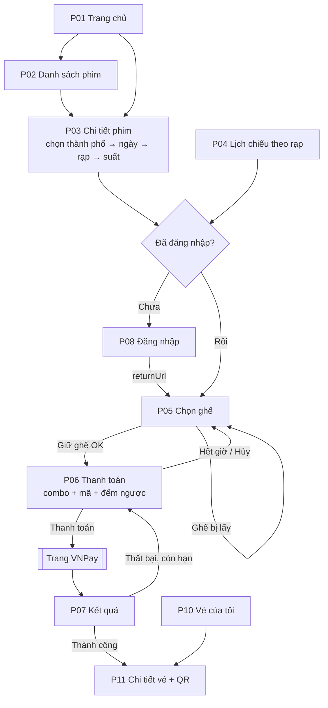

# 05 — Thiết kế giao diện (Trang & luồng điều hướng)

> Phiên bản: 1.0 — chốt ngày 02/10/2026. Thương hiệu: **Cinemind** (không dùng nhận diện CGV).
> Ưu tiên theo `01-requirements.md`: M = MVP, S = nên có, C = có thì tốt.

## 1. Danh sách trang

### 1.1 Khách hàng (Guest + Thành viên)

| Mã | Trang | Đường dẫn | Quyền | Ưu tiên | FR |
|---|---|---|---|---|---|
| P01 | Trang chủ | `/` | Công khai | M | FR-01, FR-06 |
| P02 | Danh sách phim | `/movies?status=now\|soon&q=&genre=` | Công khai | M | FR-01, FR-04 |
| P03 | Chi tiết phim + chọn suất | `/movies/:slug` | Công khai | M | FR-02, FR-03 |
| P04 | Danh sách rạp / lịch chiếu theo rạp | `/cinemas`, `/cinemas/:id` | Công khai | S | FR-05 |
| P05 | **Chọn ghế** ⭐ | `/booking/showtimes/:showtimeId` | USER | M | FR-11 |
| P06 | **Thanh toán** (combo + mã + tổng) ⭐ | `/booking/orders/:orderId` | USER (chủ đơn) | M | FR-12→14 |
| P07 | Kết quả thanh toán | `/payment/result` | USER | M | FR-14 |
| P08 | Đăng nhập | `/login?returnUrl=` | Công khai | M | FR-10 |
| P09 | Đăng ký | `/register` | Công khai | M | FR-10 |
| P10 | Vé của tôi | `/me/tickets` | USER | M | FR-15 |
| P11 | Chi tiết vé + QR | `/me/tickets/:code` | USER (chủ đơn) | M | FR-15 |
| P12 | Hồ sơ cá nhân | `/me/profile` | USER | S | FR-16 |
| P13 | Không tìm thấy / Không có quyền | `*`, `/403` | Công khai | M | — |

### 1.2 Nhân viên

| Mã | Trang | Đường dẫn | Quyền | Ưu tiên |
|---|---|---|---|---|
| S01 | Soát vé | `/staff/check-in` | STAFF, ADMIN | S |

### 1.3 Quản trị (layout riêng: sidebar trái + nội dung)

| Mã | Trang | Đường dẫn | Ưu tiên |
|---|---|---|---|
| A01 | Tổng quan / báo cáo doanh thu | `/admin` | S |
| A02 | Phim (danh sách + form) | `/admin/movies` | M |
| A03 | Suất chiếu (lọc theo rạp, phòng, ngày) | `/admin/showtimes` | M |
| A04 | Rạp, phòng, xem sơ đồ ghế | `/admin/cinemas` | S |
| A05 | Bảng giá | `/admin/pricing` | M |
| A06 | Đơn hàng (lọc theo trạng thái, xử lý REFUND_PENDING) | `/admin/orders` | M |
| A07 | Combo | `/admin/combos` | S |
| A08 | Khuyến mãi | `/admin/promotions` | S |
| A09 | Tài khoản & phân quyền | `/admin/users` | S |
| A10 | Banner | `/admin/banners` | C |

> **Mẹo tiết kiệm công:** A02, A07, A08, A09, A10 dùng chung một khuôn "bảng danh sách + bộ lọc + form trong modal". Làm kỹ một lần (A02), các trang còn lại sao chép và đổi cột.

## 2. Luồng điều hướng



**Quy tắc điều hướng:**
- Route cần đăng nhập bọc bởi `RequireAuth`; route theo vai trò bọc bởi `RequireRole(['ADMIN'])`… Chưa đăng nhập → chuyển `/login?returnUrl=<trang hiện tại>` → đăng nhập xong quay lại đúng chỗ.
- Luồng đặt vé tối đa **4 màn hình** (P03 → P05 → P06 → P07).
- Header: logo, Phim, Rạp, Khuyến mãi, ô tìm kiếm; góc phải: Đăng nhập **hoặc** menu tài khoản (Vé của tôi, Hồ sơ, [Soát vé], [Quản trị], Đăng xuất) tùy vai trò.

## 3. Wireframe các trang chính

### P01 — Trang chủ
```
┌──────────────────────────────────────────────────────────┐
│ CINEMIND Phim  Rạp  Khuyến mãi   [🔍 Tìm phim...]  [Đăng nhập]│
├──────────────────────────────────────────────────────────┤
│  ◀        BANNER TRƯỢT (khuyến mãi / phim hot)        ▶   │
├──────────────────────────────────────────────────────────┤
│  [ Đang chiếu ]  [ Sắp chiếu ]                  Xem tất cả →│
│  ┌────┐ ┌────┐ ┌────┐ ┌────┐ ┌────┐                        │
│  │post│ │post│ │post│ │post│ │post│   ← poster + T13 badge │
│  └────┘ └────┘ └────┘ └────┘ └────┘                        │
│  Tên phim  Tên phim  ...   [Mua vé]                          │
├──────────────────────────────────────────────────────────┤
│  Khuyến mãi nổi bật: ▢ ▢ ▢                                 │
│  Footer: giới thiệu, liên hệ, điều khoản                   │
└──────────────────────────────────────────────────────────┘
```

### P03 — Chi tiết phim + chọn suất
```
┌──────────────────────────────────────────────────────────┐
│ ┌──────┐  TÊN PHIM                         [T16]          │
│ │poster│  Thể loại · 120 phút · Khởi chiếu 03/10          │
│ │      │  Đạo diễn / Diễn viên / Mô tả...                 │
│ └──────┘  [▶ Xem trailer]                                 │
├──────────────────────────────────────────────────────────┤
│ Thành phố: [Hà Nội ▾]                                     │
│ Ngày: [T6 02/10] [T7 03/10] [CN 04/10] ... (7 ngày)        │
│ ── Rạp A ────────────────────────────────────────         │
│    2D Phụ đề:   [09:30] [13:15] [19:45]                    │
│    3D Lồng tiếng: [16:00]                                  │
│ ── Rạp B ────────────────────────────────────────         │
│    2D Phụ đề:   [10:00] [20:30]                            │
└──────────────────────────────────────────────────────────┘
  (Suất còn < 15 phút trước giờ chiếu: ẩn hoặc làm mờ — BR-04)
```

### P05 — Chọn ghế ⭐
```
┌──────────────────────────────────────────────────────────┐
│ Tên phim · Rạp A · Phòng 3 · 19:45 T6 02/10 · 2D Phụ đề    │
├──────────────────────────────────────────────────────────┤
│                    ═════ MÀN HÌNH ═════                    │
│   A  ▢ ▢ ▢ ▢ ▢ ▢ ▢ ▢ ▢ ▢ ▢ ▢                              │
│   ...                                                     │
│   F  ◆ ◆ ◆ ■ ■ ◆ ◆ ◆ ◆ ◆ ◆ ◆   ← hàng VIP                  │
│   G  ◆ ◆ ◆ ◆ ◆ ◆ ✔ ◆ ◆ ◆ ◆ ◆                              │
│   H  [▭▭] [▭▭] [▭▭] [▭▭] [▭▭]   ← ghế đôi                  │
│                                                           │
│ Chú thích: ▢ Thường ◆ VIP [▭▭] Đôi ✔ Đang chọn            │
│            ▒ Đang giữ  ■ Đã bán                           │
├──────────────────────────────────────────────────────────┤
│ Ghế: G7 (VIP)                      Tạm tính: 105.000đ      │
│ [← Quay lại]                              [Tiếp tục →]     │
└──────────────────────────────────────────────────────────┘
```
- Sơ đồ tự làm mới mỗi 10–15 giây (NFR-12); trên điện thoại cuộn ngang.
- Bấm ghế đôi chọn cả cặp; chặn chọn quá 8 ghế ngay trên giao diện (server vẫn kiểm tra lại).
- Lỗi `SEAT_UNAVAILABLE`: thông báo nổi, tải lại sơ đồ, **giữ nguyên** các ghế còn hợp lệ, bỏ chọn ghế bị mất.

### P06 — Thanh toán ⭐
```
┌──────────────────────────────────────────────────────────┐
│ ⏱ Thời gian giữ ghế còn lại: 08:42                        │
├───────────────────────────────┬──────────────────────────┤
│ COMBO BẮP NƯỚC                │ TÓM TẮT ĐƠN               │
│ ▢ Combo 1 Bắp + 1 Nước 69.000 │ Tên phim · 19:45 02/10    │
│   [-] 1 [+]                   │ Rạp A · Phòng 3           │
│ ▢ Combo Đôi         109.000   │ Ghế: G7 (VIP)  105.000    │
│   [-] 0 [+]                   │ Combo:          69.000    │
│                               │ Giảm giá:      -20.000    │
│ MÃ KHUYẾN MÃI                 │ ──────────────────────    │
│ [ NHAPMA      ] [Áp dụng]     │ TỔNG:          154.000đ   │
│ ✔ Đã áp dụng: giảm 20.000     │                           │
│                               │ [Hủy đơn]  [Thanh toán →] │
└───────────────────────────────┴──────────────────────────┘
```
- Mọi con số do **server** trả về sau mỗi thay đổi; client không tự tính.
- Đồng hồ hết giờ → hộp thoại "Đã hết thời gian giữ ghế" → về P05.

### P07 — Kết quả thanh toán
```
   ⏳ Đang xác nhận thanh toán...   (hỏi server mỗi 2 giây, tối đa 30 giây)
   ✅ Đặt vé thành công!  [Xem vé]          ← đơn PAID
   ❌ Thanh toán chưa thành công. [Thử lại] ← đơn còn PENDING, còn hạn
   ⚠️ Đơn đã hết hạn giữ ghế ...            ← EXPIRED / REFUND_PENDING (kèm hướng dẫn liên hệ)
```
> Trang này chỉ **đọc** trạng thái đơn từ server — không tự kết luận dựa vào tham số trên URL (nguyên tắc IPN).

### P11 — Chi tiết vé
```
┌──────────────────────────────┐
│        ┌──────────┐          │
│        │ QR CODE  │          │
│        └──────────┘          │
│     Mã đặt vé: K7Q2-M9XA     │
│  Tên phim [T16]              │
│  Rạp A · Phòng 3             │
│  19:45 T6 02/10/2026         │
│  Ghế: G7, G8                 │
│  Combo: 1 × Combo 1          │
│  Tổng: 154.000đ · Đã thanh toán│
│  Trạng thái: Chưa sử dụng    │
└──────────────────────────────┘
```

### S01 — Soát vé
```
┌──────────────────────────────────────────┐
│ Mã đặt vé: [ K7Q2-M9XA ] [Tra cứu]        │
├──────────────────────────────────────────┤
│ ✅ HỢP LỆ                                 │
│ Tên phim [T16] · Phòng 3 · 19:45          │
│ Ghế: G7, G8 · Khách: Nguyễn Văn A         │
│              [ CHECK-IN ]                 │
├──────────────────────────────────────────┤
│ ❌ Vé đã sử dụng lúc 19:32 / Sai suất /   │
│    Chưa tới giờ / Suất đã qua (BR-34)     │
└──────────────────────────────────────────┘
```

### Khuôn trang quản trị (A02, A07–A10)
```
┌──────────┬───────────────────────────────────────────────┐
│ Tổng quan│ Phim                           [+ Thêm phim]  │
│ Phim     │ [🔍 Tìm...] [Trạng thái ▾]                     │
│ Suất chiếu│ ┌──────┬──────────┬──────┬────────┬────────┐  │
│ Rạp      │ │Poster│ Tên      │ Thời lượng│Trạng thái│ ⋯  │ │
│ Bảng giá │ ├──────┼──────────┼──────┼────────┼────────┤  │
│ Đơn hàng │ │ ...  │ ...      │ ...  │ ...    │Sửa/Ẩn │  │
│ Combo    │ └──────┴──────────┴──────┴────────┴────────┘  │
│ Khuyến mãi│               « 1 2 3 »                       │
│ Tài khoản│  (Form thêm / sửa mở trong modal)              │
└──────────┴───────────────────────────────────────────────┘
```

## 4. Quy ước giao diện chung

| Hạng mục | Quy ước |
|---|---|
| Trạng thái dữ liệu | Mỗi trang có đủ 3 trạng thái: **đang tải** (skeleton), **rỗng**, **lỗi** (kèm nút thử lại) |
| Thông báo | Toast cho thành công / lỗi ngắn; hộp thoại cho lỗi chặn luồng (hết giờ giữ ghế) |
| Tiền, giờ | Định dạng `154.000đ`; giờ Việt Nam `19:45 T6 02/10/2026` |
| Responsive | Tối thiểu 360 px; sơ đồ ghế cuộn ngang trên điện thoại (NFR-16) |
| Màu trạng thái ghế | Thống nhất một bộ màu cho Thường / VIP / Đôi / Đang chọn / Đang giữ / Đã bán, kèm chú thích |
| Dữ liệu từ server | Dùng TanStack Query; dữ liệu giả (mock) theo đúng `04-api-contract.md` khi backend chưa xong |
