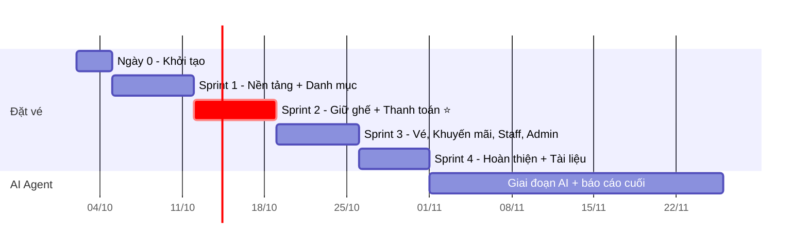

# 06 — Kế hoạch dự án & quy trình làm việc nhóm

> Phiên bản: 1.0 — chốt ngày 02/10/2026 · Hệ thống: **Cinemind**
> Người A = Backend (`server/`) · Người B = Frontend (`client/`)
> Mốc nội bộ: **hệ thống đặt vé hoàn chỉnh trước 01/11/2026**. Hạn trường: cuối tháng 11.

## 1. Lộ trình tổng thể

## 2. Kế hoạch từng sprint

### Ngày 0 (02/10 – 04/10) — Khởi tạo

| Người A | Người B | Chung |
|---|---|---|
| Tạo `server/`, cài thư viện, `app.js`, middleware response + lỗi chuẩn | Tạo `client/` (Vite + Tailwind + Router + TanStack Query), Axios instance | Tạo repo GitHub, bảo vệ nhánh `main`, chép `docs/` vào repo |
| Chép `schema.prisma`, chạy `prisma validate` + `migrate dev` | Cài MSW, tạo mock cho Auth + Danh mục theo hợp đồng | **Đăng ký tài khoản VNPay sandbox ngay** (có thể mất vài ngày) |

### Sprint 1 (05/10 – 11/10) — Nền tảng + Danh mục

**Mục tiêu:** khách xem phim, xem lịch chiếu, đăng nhập và mở được trang sơ đồ ghế (chỉ xem) bằng dữ liệu thật.

| Người A | Người B |
|---|---|
| Seed: thành phố, rạp, phòng, sơ đồ ghế, phim, thể loại, suất chiếu 7 ngày, bảng giá | Layout chung: Header (menu theo vai trò), Footer |
| Auth: register, login, refresh (cookie), logout, me; `requireAuth`, `requireRole` | `AuthContext`, interceptor refresh token, `RequireAuth` + `returnUrl` |
| API danh mục: movies, movie detail, genres, cities, cinemas | P01 Trang chủ, P02 Danh sách phim (tìm, lọc), P03 Chi tiết phim |
| `GET /movies/:id/showtimes`, `GET /showtimes/:id`, `GET /showtimes/:id/seats` | `ShowtimePicker` (thành phố → ngày → rạp → suất), P08/P09 Đăng nhập, Đăng ký |
| `pricing.service` (BR-11 → BR-13) | P05 bản đầu: vẽ `SeatMap` từ API (chưa giữ ghế) |

**Đồng bộ:** T4 07/10 ghép Auth thật · CN 11/10 demo sprint + lập kế hoạch Sprint 2.

**Definition of Done:** chạy được từ repo sạch theo README; luồng *Trang chủ → Chi tiết phim → chọn suất → (đăng nhập) → thấy sơ đồ ghế thật* chạy trơn với backend thật, không dùng mock.

### Sprint 2 (12/10 – 18/10) — Giữ ghế + Thanh toán ⭐ (sprint quan trọng nhất)

**Mục tiêu:** luồng cốt lõi chạy trọn từ chọn ghế đến nhận vé qua VNPay sandbox.

| Người A | Người B |
|---|---|
| `booking.service.holdSeats` (transaction + UNIQUE), `POST /orders`, `GET /orders/:id`, `cancel` | `SeatMap` đầy đủ: chọn / bỏ chọn, ghế đôi theo cặp, chặn > 8 ghế, tự làm mới 10–15 giây |
| `PUT /orders/:id/combos`, `GET /combos` | Xử lý `SEAT_UNAVAILABLE`: giữ ghế hợp lệ, bỏ ghế bị mất, thông báo |
| `jobs/expireOrders` (mỗi phút) | P06 Thanh toán: `Countdown`, `ComboPicker`, `OrderSummary`, nút Hủy, hết giờ → về P05 |
| `lib/vnpay` + `POST /orders/:id/payments`, `GET /payments/vnpay/ipn` (`confirmPayment`), `GET /payments/:txnRef/status`, `/dev/.../simulate` | P07 Kết quả: hỏi trạng thái mỗi 2 giây, các nhánh thành công / thất bại / hết hạn |
| **Test đồng thời:** 50 request giữ cùng ghế → đúng 1 thành công; test IPN lặp, IPN muộn | Thử luồng thật với VNPay sandbox (thẻ test) |

**Đồng bộ:** T3 13/10 ghép giữ ghế thật · T6 16/10 chạy VNPay sandbox từ đầu đến cuối · CN 18/10 demo.

**Definition of Done:** chọn ghế → thanh toán VNPay sandbox → đơn `PAID` có QR; 2 trình duyệt chọn cùng ghế → chỉ 1 người được; để hết 10 phút → ghế tự nhả; test đồng thời pass.

> 🚨 **Điểm kiểm tra rủi ro:** nếu CN 18/10 luồng này chưa chạy trọn → Sprint 3 dồn sức hoàn thiện luồng cốt lõi, cắt FR-35/36/37 sang Sprint 4 hoặc bỏ (theo thứ tự cắt giảm ở `01-requirements.md`).

### Sprint 3 (19/10 – 25/10) — Vé, khuyến mãi, nhân viên, admin cốt lõi

**Mục tiêu:** hoàn tất toàn bộ yêu cầu **Must** và các **Should** quan trọng.

| Người A | Người B |
|---|---|
| `promotion.service` + `POST/DELETE /orders/:id/promotion` | Ô nhập mã khuyến mãi ở P06 + các lý do lỗi `PROMO_INVALID` |
| `GET /me/orders`, `GET /me/orders/:code` (+ `qrContent`) | P10 Vé của tôi, P11 Chi tiết vé + QR |
| Staff: tra cứu, check-in (BR-33, BR-34) | S01 Soát vé |
| Admin: phim (CRUD, ngừng chiếu), suất chiếu (chặn trùng giờ), bảng giá, đơn hàng (+ đánh dấu hoàn tiền), combo, khuyến mãi | `AdminLayout`, khuôn `DataTable` + `FormModal`; A02 Phim, A03 Suất chiếu, A05 Bảng giá, A06 Đơn hàng, A07 Combo, A08 Khuyến mãi |

**Đồng bộ:** T4 21/10 ghép vé + staff · CN 25/10 demo.

**Definition of Done:** mọi mục **M** trong `01-requirements.md` chạy với backend thật; admin tạo phim + suất mới → khách đặt được → nhân viên check-in được.

### Sprint 4 (26/10 – 31/10) — Hoàn thiện, kiểm thử, tài liệu

| Người A | Người B | Chung |
|---|---|---|
| Admin tài khoản (tạo STAFF, khóa), báo cáo doanh thu | A09 Tài khoản, A01 Tổng quan (biểu đồ đơn giản) | **T5 29/10: "bug bash"** — cả hai cùng phá thử hệ thống |
| Hồ sơ cá nhân, đổi mật khẩu, rate limit đăng nhập | P12 Hồ sơ, rà responsive 360 px, trạng thái tải / rỗng / lỗi | Viết **test case** (đối chiếu FR / NFR / BR) |
| Seed dữ liệu demo đẹp, README cài đặt | Chụp màn hình viết **hướng dẫn sử dụng** | Kịch bản demo 10 phút, tập 2 lần |
| (Tùy chọn) deploy | | **T6 30/10: đóng băng code** — chỉ sửa lỗi |

**Definition of Done:** không còn lỗi chặn luồng Must; đủ tài liệu nhà trường yêu cầu cho phần đặt vé; demo chạy được cả khi **không có mạng** (dùng endpoint giả lập IPN).

**Chỉ làm nếu dư thời gian (mục C):** banner, email gửi vé, tích điểm, quét QR bằng camera.

## 3. Nhịp làm việc

| Hoạt động | Khi nào | Nội dung |
|---|---|---|
| Họp nhanh (nhắn tin cũng được) | Mỗi tối, 10 phút | Hôm nay xong gì · ngày mai làm gì · đang vướng gì |
| Ngày ghép nối | Giữa sprint (lịch ở trên) | Tắt mock của các endpoint đã xong, chạy thử chung |
| Demo + lập kế hoạch | Chủ nhật cuối sprint | Demo cho nhau xem theo DoD; chọn việc sprint sau; cập nhật tài liệu nếu thiết kế thay đổi |

## 4. Quy trình Git

### 4.1 Nhánh (GitHub Flow — phù hợp nhóm 2 người)

- `main`: **luôn chạy được và demo được**. Không ai đẩy thẳng lên `main` — bật *branch protection*, bắt buộc Pull Request (PR).
- Nhánh tính năng tách từ `main`, đặt tên: `<loại>/<phía>-<mô-tả>`

| Ví dụ | Dùng khi |
|---|---|
| `feat/be-hold-seats`, `feat/fe-seat-map` | Tính năng mới |
| `fix/be-ipn-duplicate` | Sửa lỗi |
| `docs/api-contract-v1.1` | Sửa tài liệu |
| `chore/setup-eslint`, `test/be-concurrency` | Cấu hình, test |

- Mỗi nhánh sống **1–3 ngày**; nhánh càng lâu càng dễ xung đột.

### 4.2 Commit

Theo chuẩn *Conventional Commits*: `feat: giữ ghế theo transaction`, `fix: nhả ghế khi hủy đơn`, `docs: cập nhật mã lỗi`, `test: kiểm thử 50 request đồng thời`.

### 4.3 Pull Request & review chéo

1. PR nhỏ (lý tưởng < 400 dòng thay đổi), mô tả theo mẫu: **Làm gì · Vì sao · Cách test · Ảnh chụp (nếu có giao diện)**.
2. Người còn lại review **trong 24 giờ**.
3. **Squash merge** vào `main`, xóa nhánh.

**Checklist review (cả hai dùng chung):**

- [ ] Kéo nhánh về chạy được, làm theo "Cách test" thấy đúng
- [ ] Đúng hợp đồng API (tên trường, mã lỗi, định dạng response)
- [ ] Backend: controller không import Prisma; logic nằm trong service
- [ ] Frontend: page không gọi Axios trực tiếp; có trạng thái tải / lỗi
- [ ] Không có `console.log` thừa, không có mật khẩu / khóa bí mật trong code
- [ ] Có cập nhật `.env.example` / tài liệu nếu cần

> **Review chéo khi không rành phía bên kia:** Người B review backend tập trung vào *đúng hợp đồng + dễ đọc + chạy được*; Người A review frontend tập trung vào *gọi API đúng + xử lý lỗi theo `code`*. Mục tiêu là **cả hai đều hiểu toàn hệ thống** — hội đồng có thể hỏi bất kỳ ai về bất kỳ phần nào.

### 4.4 Tránh đụng file nhau

- Chủ sở hữu: Người A — `server/**`; Người B — `client/**`; `docs/**` — chung (xem `04-api-contract.md` mục 5.6).
- Mỗi nhóm chức năng nằm trong file riêng → hai PR khác tính năng hiếm khi sửa cùng file.
- Trước khi bắt đầu việc mới: `git pull` nhánh `main` mới nhất.

## 5. Definition of Done chung (áp dụng cho mọi việc)

Một việc chỉ được tính là **xong** khi:

1. Đã merge vào `main` qua PR có review.
2. Chạy được từ repo sạch theo README.
3. Đúng `04-api-contract.md` (hoặc hợp đồng đã được cập nhật trước).
4. Đã thử tay luồng thành công **và** ít nhất một luồng lỗi.
5. Không có lỗi đỏ trong console trình duyệt / log server.

## 6. Rủi ro tiến độ & phương án

| Rủi ro | Dấu hiệu sớm | Phương án |
|---|---|---|
| Đăng ký VNPay sandbox chậm | Hết Ngày 0 chưa có mã | Dùng endpoint giả lập IPN để phát triển; tích hợp thật khi có mã |
| Luồng giữ ghế + thanh toán trễ | CN 18/10 chưa đạt DoD Sprint 2 | Dồn cả hai người vào luồng cốt lõi; cắt Should theo thứ tự |
| Ghép nối lệch hợp đồng | Ngày ghép phát sinh nhiều lỗi tên trường | Mock phải lấy đúng JSON mẫu mục 3 của hợp đồng; sửa hợp đồng trước code |
| Một người ốm / bận thi | Họp tối báo chậm 2 ngày liên tiếp | Người kia nhận việc Should của người đó; giữ nguyên Must |
| Tài liệu dồn cuối | Tới Sprint 4 chưa có test case nào | Mỗi sprint ghi luôn test case cho tính năng vừa xong |
