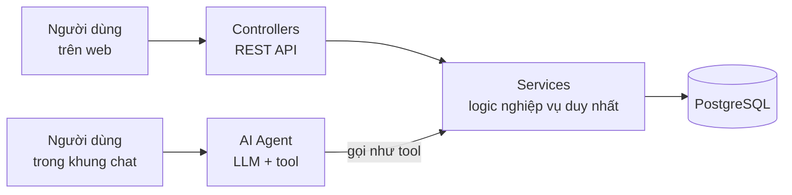
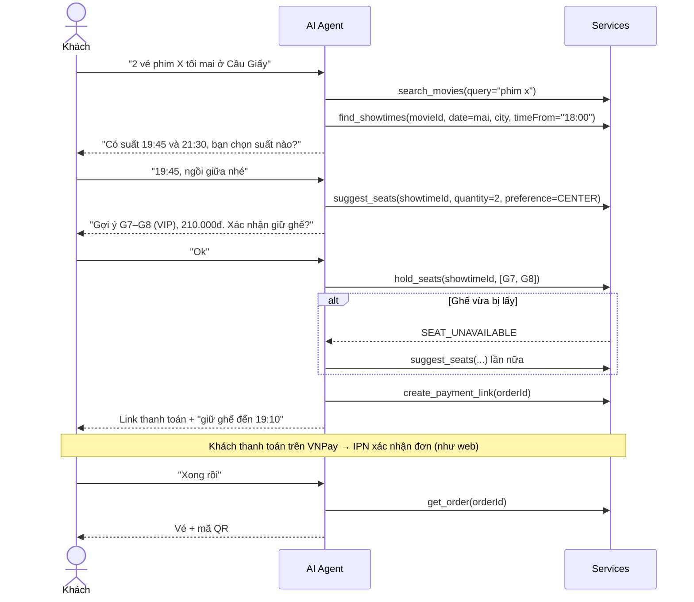

# 07 — Chuẩn bị tích hợp AI Agent

> Phiên bản: 1.0 — chốt ngày 02/10/2026 · Hệ thống: **Cinemind**
> Mục đích: thiết kế hệ thống đặt vé sao cho giai đoạn AI (tháng 11) chỉ cần **thêm** một lớp mới, không phải sửa lại lõi.

## 1. Ý tưởng chính

- AI Agent là **một "kênh" mới**, ngang hàng với controller. Nó **không** có logic nghiệp vụ riêng.
- Mọi luật (giữ ghế 10 phút, tối đa 8 ghế, chống trùng ghế, tính giá…) tự động áp dụng cho cả web lẫn chat vì cùng đi qua service.
- Thư mục dự kiến: `server/src/ai/` gồm `tools.js` (khai báo tool → service), `agent.js` (vòng lặp gọi LLM), `chat.routes.js`.

## 2. Danh sách tool (ánh xạ sang service)

**Quy ước:** `userId` **luôn do server lấy từ phiên đăng nhập** và truyền vào service — **không bao giờ** để LLM tự điền.

### 2.1 Tool chỉ đọc (gọi tự do)

| Tool | Service | Tham số | Kết quả trả về (rút gọn) |
|---|---|---|---|
| `search_movies` | `catalogService.searchMovies` | `query?` (tên, không cần dấu), `status?`, `genre?` | `[{ id, title, ageRating, durationMin, genres, status }]` |
| `get_movie_details` | `catalogService.getMovie` | `movieId` | Thông tin phim đầy đủ |
| `list_cinemas` | `catalogService.listCinemas` | `city?` (tên, không cần dấu) | `[{ id, name, address, city }]` |
| `find_showtimes` | `showtimeService.findShowtimes` | `movieId`, `date` (`YYYY-MM-DD`), `city?` / `cinemaId?`, `timeFrom?`, `timeTo?` (`HH:mm`), `format?` | `[{ showtimeId, cinemaName, startTimeLocal, format, audio, availableSeatCount, basePrice }]` — danh sách **phẳng** để LLM dễ đọc |
| `get_seat_map` | `showtimeService.getSeatMap` | `showtimeId` | Như `GET /showtimes/:id/seats` + tóm tắt `{ available, byType }` |
| `suggest_seats` | `showtimeService.suggestSeats` *(viết ở giai đoạn AI)* | `showtimeId`, `quantity`, `preference?` (`CENTER` \| `BACK` \| `AISLE`), `seatType?` | `[{ seatIds, labels, totalPrice }]` — tối đa 3 phương án ghế liền nhau |
| `list_combos` | `catalogService.listCombos` | — | `[{ id, name, price }]` |
| `get_order` | `bookingService.getOrder` | `orderId` | `Order` (cấu trúc chung) |
| `list_my_tickets` | `bookingService.listMyOrders` | `status?` | `OrderSummary[]` |

### 2.2 Tool thay đổi dữ liệu (bắt buộc người dùng xác nhận trước)

| Tool | Service | Tham số | Kết quả | Lỗi có thể gặp |
|---|---|---|---|---|
| `hold_seats` | `bookingService.holdSeats` | `showtimeId`, `seatIds` | `Order` PENDING + `expiresAt` | `SEAT_UNAVAILABLE`, `SEAT_LIMIT_EXCEEDED`, `COUPLE_SEAT_INCOMPLETE`, `SHOWTIME_CLOSED` |
| `set_combos` | `bookingService.setCombos` | `orderId`, `items: [{ comboId, quantity }]` | `Order` | `ORDER_EXPIRED` |
| `apply_promotion` | `promotionService.applyToOrder` | `orderId`, `code` | `Order` | `PROMO_INVALID` |
| `create_payment_link` | `paymentService.createPayment` | `orderId` | `{ paymentUrl, expiresAt }` | `ORDER_EXPIRED` |
| `cancel_order` | `bookingService.cancelOrder` | `orderId` | `Order` CANCELLED | `ORDER_NOT_PENDING` |

### 2.3 **Không** cấp cho AI

`confirmPayment` (chỉ IPN được gọi), check-in, mọi service quản trị, đổi vai trò / tài khoản.

## 3. Luồng mẫu: đặt vé qua hội thoại

## 4. Lưu ngữ cảnh hội thoại & "phiên đặt vé nháp"

| Giai đoạn hội thoại | Lưu ở đâu | Ghi chú |
|---|---|---|
| Đang hỏi đáp, chưa chọn ghế | `ChatSession.state` (JSON) | Ví dụ `{ "movieId": "...", "city": "Hà Nội", "date": "2026-11-05", "quantity": 2, "seatPreference": "CENTER" }`. Chưa giữ gì nên không cần bảng riêng |
| Đã giữ ghế | `Order` PENDING (bảng có sẵn) + `state.currentOrderId` | Bản nháp **chính là đơn PENDING** — đã có hạn 10 phút, đã có giá chốt, đã chống trùng ghế |
| Lịch sử tin nhắn + lần gọi tool | `ChatMessage` | Gửi lại N tin gần nhất cho LLM làm ngữ cảnh; dùng để debug và viết báo cáo |

> **Vì sao không tạo bảng `BookingDraft` riêng?** Trước khi giữ ghế, "bản nháp" chỉ là thông tin hội thoại → để trong `state`. Sau khi giữ ghế, `Order` PENDING đã đóng đúng vai bản nháp. Thêm bảng thứ ba sẽ tạo hai nguồn sự thật cho cùng một đơn.

## 5. Nguyên tắc an toàn

| Nguyên tắc | Cách làm |
|---|---|
| AI không tự quyết thay người dùng | Tool ở mục 2.2 chỉ gọi sau khi khách **xác nhận rõ ràng** trong hội thoại |
| AI không cầm tiền | Thanh toán luôn qua link VNPay do khách tự bấm; đơn chỉ thành PAID qua IPN |
| Không tin tham số từ LLM | `userId` lấy từ phiên; service vẫn kiểm tra mọi luật như với web; kiểm tra quyền sở hữu `orderId` |
| Dữ liệu là dữ liệu | Mô tả phim, tên khuyến mãi… đưa cho LLM dưới dạng dữ liệu, không phải chỉ dẫn (chống *prompt injection* — chèn lệnh qua nội dung) |
| Giới hạn chi phí | Giới hạn số tin nhắn / phút cho mỗi phiên; cắt ngắn lịch sử gửi cho LLM |
| Lỗi dễ hiểu | Tool trả lại đúng `code` + `message` tiếng Việt từ `AppError` → AI diễn đạt lại cho khách |

## 6. Việc cần làm **ngay từ bây giờ** (trong 4 sprint đặt vé)

| # | Việc | Sprint | Vì sao giúp AI |
|---|---|---|---|
| 1 | Service nhận **một object tham số** có tên rõ ràng, ví dụ `holdSeats({ userId, showtimeId, seatIds })` | 1–3 | Ánh xạ 1-1 sang tham số tool |
| 2 | Service trả **object thuần**, cùng cấu trúc với API (`Order` chung) | 1–3 | AI và web đọc cùng một dạng dữ liệu |
| 3 | Lỗi luôn là `AppError(code, message tiếng Việt)` | 1 | AI đọc `code` để xử lý tiếp, đọc `message` để nói với khách |
| 4 | Viết **JSDoc** ngắn cho mỗi hàm service public (mô tả, tham số, lỗi) | 1–3 | Chuyển gần như nguyên văn thành mô tả tool |
| 5 | `Movie.searchKey` (tên không dấu, chữ thường) do service tự điền khi tạo / sửa phim; `searchMovies` tìm theo nó | 1 | Khách gõ / nói "nha ba nu" vẫn ra "Nhà Bà Nữ" — web cũng hưởng lợi (FR-04) |
| 6 | `findShowtimes` hỗ trợ `timeFrom` / `timeTo` và trả `availableSeatCount` | 1 | Trả lời được "tối mai còn suất nào nhiều ghế" |
| 7 | `Order.source` = `WEB` / `AI_CHAT` | 2 | Báo cáo tỉ lệ đặt vé qua AI — số liệu đẹp cho chương kết quả |
| 8 | Không đặt luật nghiệp vụ ở React (ví dụ ghế đôi, tối đa 8 ghế) mà **không** có bản kiểm tra ở service | 2 | Kênh chat không có React — chỉ service bảo vệ được |

Đã cập nhật `schema.prisma`: `Movie.searchKey`, `Order.source`, model `ChatSession`, `ChatMessage` (tạo bảng sẵn, chưa dùng ở 4 sprint đầu).

## 7. Câu hỏi để mở ở giai đoạn AI (chưa quyết bây giờ)

- Chọn nhà cung cấp LLM và cách gọi tool (function calling).
- Khách chưa đăng nhập có được chat không (chỉ tool đọc?) và chuyển sang đăng nhập giữa hội thoại thế nào.
- Hiển thị kết quả trong khung chat: chữ thuần hay nhúng component (`SeatMap`, `OrderSummary`) — đã chuẩn bị bằng component "thuần".
- Có dùng Redis cho bộ nhớ phiên / giới hạn tần suất không.
